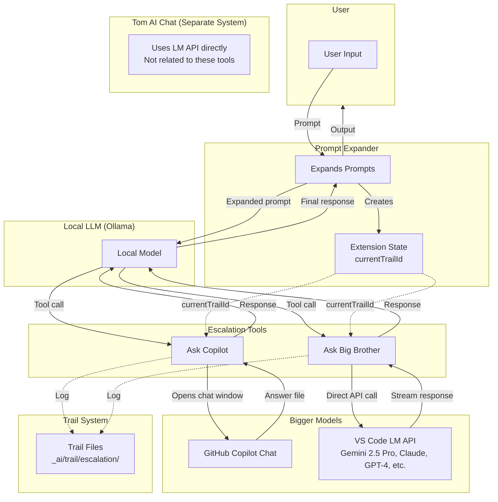
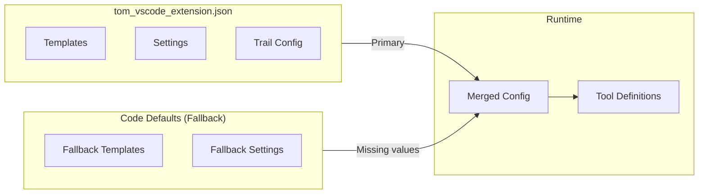
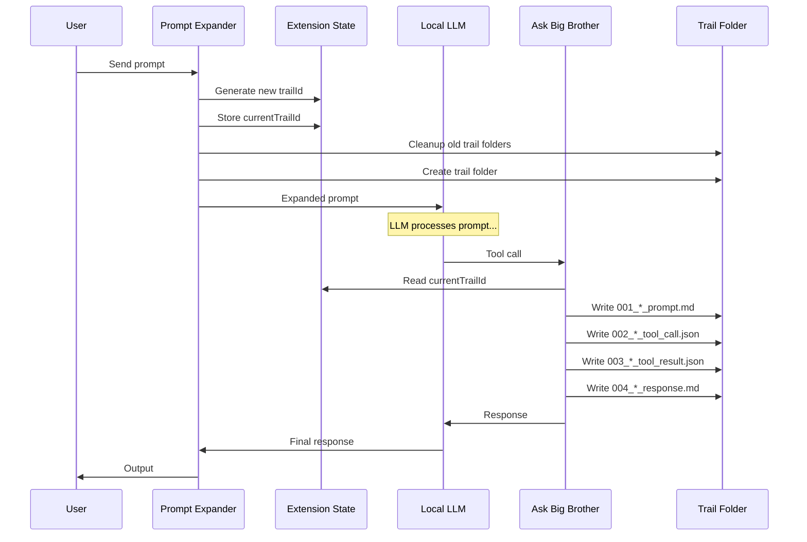
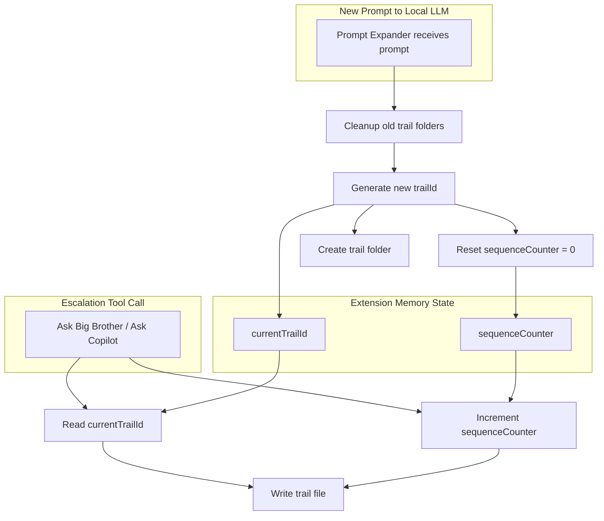
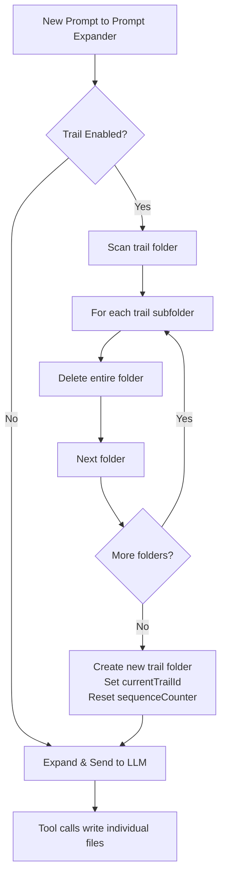
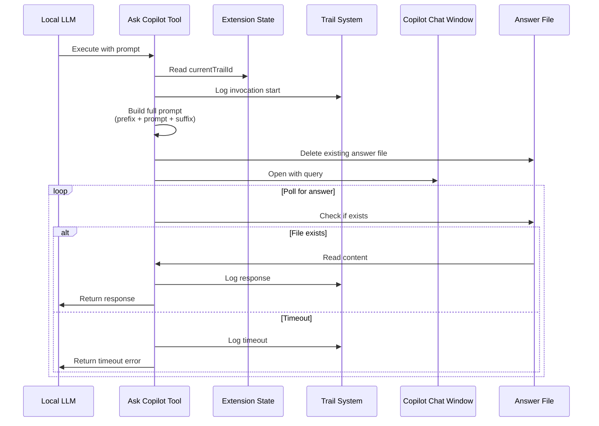
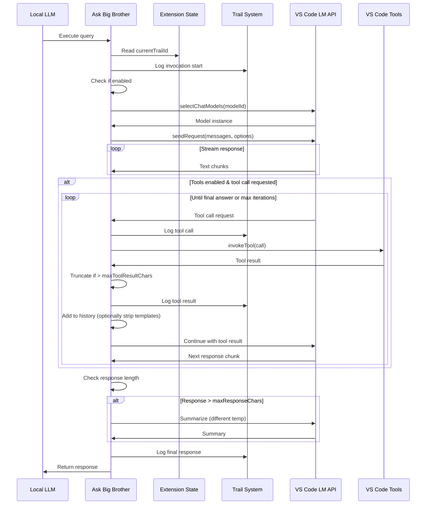
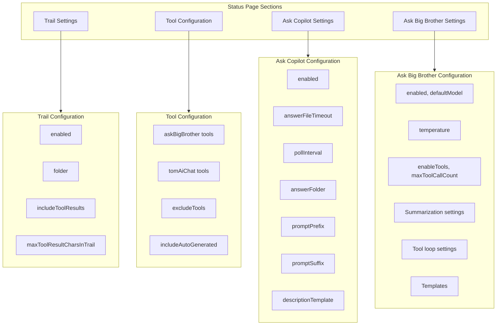
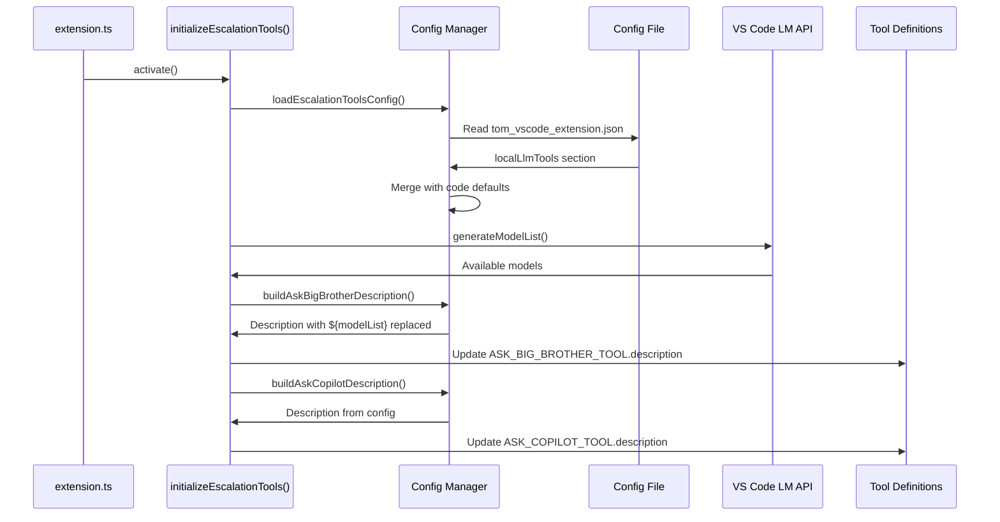
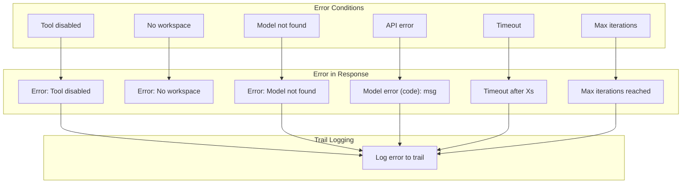

# Ask AI Tools - Escalation Path for Local LLM

This document describes the two AI escalation tools implemented in the Tom VS Code extension. These tools allow a local LLM (running via Ollama) to escalate complex questions to more powerful models.

## Overview



**Important:** These escalation tools are registered for the **Local LLM (via Prompt Expander)** only. Tom AI Chat is a separate system that uses the VS Code LM API directly - it does not use these tools.

## Architecture

### File Structure

| File | Purpose |
|------|---------|
| `src/tools/escalation-tools-config.ts` | Configuration types, loading, saving |
| `src/tools/tool-executors.ts` | Tool implementations (execute functions) |
| `src/handlers/statusPage-handler.ts` | Status page UI for editing settings |
| `~/.tom/vscode/tom_vscode_extension.json` | **All configuration including templates** |

### Configuration Source

All templates and settings are stored in the JSON configuration file. Code defaults are used only when config values are missing.



## Complete Configuration Schema

### Configuration File Structure

```json
{
  "localLlmTools": {
    "trail": {
      "enabled": true,
      "folder": "_ai/trail/escalation",
      "includeToolResults": true,
      "maxToolResultCharsInTrail": 5000
    },
    "toolConfiguration": {
      "askBigBrother": {
        "tools": ["vscode.readFile", "vscode.grep", "vscode.listDir", "vscode.webSearch"],
        "excludeTools": [],
        "includeAutoGenerated": true
      },
      "tomAiChat": {
        "tools": ["vscode.readFile", "vscode.grep", "vscode.listDir", "vscode.webSearch", "vscode.editFile"],
        "excludeTools": [],
        "includeAutoGenerated": true
      }
    },
    "askCopilot": {
      "enabled": true,
      "answerFileTimeout": 120000,
      "pollInterval": 2000,
      "answerFolder": "_ai/chat_replies",
      "promptPrefix": "",
      "promptSuffix": "...(answer file instructions)...",
      "descriptionTemplate": "...(tool description for LLM)..."
    },
    "askBigBrother": {
      "enabled": true,
      "defaultModel": "gemini-2.5-pro",
      "temperature": 0.7,
      "enableTools": true,
      "maxToolCallCount": 25,
      "maxToolResultChars": 10000,
      "responseTimeout": 120000,
      "descriptionTemplate": "...(tool description with placeholders)...",
      "modelRecommendations": "...(static model advice)...",
      "summarization": {
        "enabled": true,
        "model": "gpt-4o-mini",
        "temperature": 0.3,
        "maxResponseChars": 20000,
        "promptTemplate": "...(summarization prompt)..."
      },
      "toolLoop": {
        "toolResultPromptTemplate": "Tool '{toolName}' returned:\n\n{result}",
        "continuePrompt": "Based on the tool result above, continue with your response or use another tool if needed.",
        "maxResultsPrompt": "Maximum tool calls ({maxToolCallCount}) reached. Please provide your final answer based on the information gathered.",
        "stripTemplatesFromHistory": true
      }
    }
  }
}
```

## Trail System

### Purpose

The trail system logs all escalation tool invocations for debugging, auditing, and context preservation. Each step produces a **separate file** - prompts, responses, tool calls, and tool results are all individual files within a trail folder.

### Trail Structure

Trail files use the **same naming convention** as the local LLM trail (`_ai/local/trail/`):

```
_ai/trail/escalation/
└── <trailId>/
    ├── 20260212_103000_001_prompt_to_gemini-2.5-pro.md
    ├── 20260212_103001_002_response_partial_from_gemini-2.5-pro.md
    ├── 20260212_103001_003_toolrequest_vscode.readFile.json
    ├── 20260212_103002_004_toolresult_vscode.readFile.json
    ├── 20260212_103002_005_continuation_to_gemini-2.5-pro.md
    ├── 20260212_103010_006_response_final_from_gemini-2.5-pro.md
    ├── 20260212_103015_007_prompt_to_copilot.md
    └── 20260212_103045_008_copilot_answer.json
```

### Filename Format

`<date>_<time>_<sequence>_<type>_<detail>.<ext>`

| Component | Format | Description |
|-----------|--------|-------------|
| `date` | `YYYYMMDD` | Date |
| `time` | `HHMMSS` | Time (24h, seconds) |
| `sequence` | `NNN` | Order within the trail (001-999) |
| `type` | snake_case | Step type (see below) |
| `detail` | varies | Model name or tool name |
| `ext` | `md`/`json` | Format based on content type |

### Step Types and Formats

| Type | Detail | Extension | Content |
|------|--------|-----------|--------|
| `prompt_to` | model name | `.md` | Prompt sent to model |
| `response_partial_from` | model name | `.md` | Response before tool call |
| `response_final_from` | model name | `.md` | Final response |
| `toolrequest` | tool name | `.json` | Tool invocation request |
| `toolresult` | tool name | `.json` | Tool execution result |
| `continuation_to` | model name | `.md` | Continuation after tool result |
| `prompt_to` | `copilot` | `.md` | Prompt sent to Copilot |
| `copilot_answer` | - | `.json` | Copied from Copilot answer file |
| `summarization_prompt` | model name | `.md` | Prompt for summarization |
| `summarization_response` | model name | `.md` | Summarized response |
| `error` | - | `.md` | Error details |

### Internal Session Management

The trail ID is managed **internally by the extension** - the LLM does not need to pass any parameters. The Prompt Expander maintains session state in memory:



### State Management Flow



### Why Internal State?

| Approach | Problem |
|----------|---------|
| LLM passes trailId | Unreliable - LLM may forget or omit "optional" parameters |
| Extension internal state | Reliable - extension always knows current session context |

The extension maintains `currentTrailId` and `sequenceCounter` in memory. When a tool writes a trail step, it reads from this state - no parameter passing needed.

### Example Trail Files

**001_103000000_prompt.md:**
```markdown
# Ask Big Brother Prompt

Read the README.md file and summarize the project architecture.
```

**002_103001234_tool_call.json:**
```json
{
  "tool": "vscode.readFile",
  "input": {
    "path": "README.md"
  }
}
```

**003_103002456_tool_result.json:**
```json
{
  "tool": "vscode.readFile",
  "success": true,
  "chars": 2456,
  "truncated": false,
  "result": "# Project Name\n\nThis project..."
}
```

**004_103010345_response.md:**
```markdown
# Ask Big Brother Response

Based on the README.md file, the project architecture consists of...
```

**008_103045789_copilot_answer.json:**
```json
{
  "response": "I've analyzed the code and...",
  "source": "copied_from_answer_file",
  "originalPath": "_ai/chat_replies/abc123_answer.json"
}
```

### Trail Cleanup Flow

Trail cleanup happens when a **new prompt arrives**. Old trail **folders** are deleted before creating the new trail:



### Trail Configuration Options

| Option | Type | Default | Description |
|--------|------|---------|-------------|
| `enabled` | boolean | `true` | Enable/disable trail logging |
| `folder` | string | `_ai/trail/escalation` | Root folder for trails |
| `includeToolResults` | boolean | `true` | Include tool results in trail |
| `maxToolResultCharsInTrail` | number | `5000` | Truncate tool results in trail |

**Note:** Trail cleanup happens on each new prompt - all previous trail folders are deleted. There is no time-based retention.

## Tool Configuration

### Purpose

The tool configuration controls which VS Code tools are made available to which model in which context. This allows experimentation with different tool sets without code changes.

### Context Differences

| Context | Description | Typical Tools |
|---------|-------------|---------------|
| `askBigBrother` | Remote LLM called via Ask Big Brother tool | Read-only tools (read, grep, list, search) |
| `tomAiChat` | Remote LLM called directly via Tom AI Chat | Full tools including edit, run commands |

### Configuration Options

| Option | Type | Description |
|--------|------|-------------|
| `tools` | string[] | Array of tool IDs to include |
| `excludeTools` | string[] | Array of tool IDs to exclude (overrides `tools`) |
| `includeAutoGenerated` | boolean | Include auto-generated tool info in descriptions |

### Tool Description Enhancement

Tool descriptions can include auto-generated information:
- Available file list in workspace
- Current open files
- Active selection details
- Terminal state

When `includeAutoGenerated: true`, this information is dynamically injected into tool descriptions.

### Example Configuration

```json
{
  "toolConfiguration": {
    "askBigBrother": {
      "tools": ["vscode.readFile", "vscode.grep", "vscode.listDir", "vscode.webSearch"],
      "excludeTools": [],
      "includeAutoGenerated": true
    },
    "tomAiChat": {
      "tools": ["vscode.readFile", "vscode.grep", "vscode.listDir", "vscode.webSearch", "vscode.editFile", "vscode.runCommand"],
      "excludeTools": [],
      "includeAutoGenerated": true
    }
  }
}
```

### Why Different Tool Sets?

| Reason | Explanation |
|--------|-------------|
| **Safety** | Ask Big Brother calls may be less supervised - limit dangerous operations |
| **Token efficiency** | Fewer tools = shorter prompts = cheaper and faster |
| **Experimentation** | Easy to test how models behave with different tool availability |
| **Context focus** | Give each context only the tools it needs |

## Ask Copilot Tool

### Purpose

Send questions to GitHub Copilot via the chat window, using an answer file mechanism for the local LLM to receive responses.

### Flow Diagram



### Configuration Options

| Option | Type | Default | Description |
|--------|------|---------|-------------|
| `enabled` | boolean | `true` | Enable/disable the tool |
| `answerFileTimeout` | number | `120000` | Max wait time for answer file (ms) |
| `pollInterval` | number | `2000` | How often to check for answer file (ms) |
| `answerFolder` | string | `_ai/chat_replies` | Folder for answer files |
| `promptPrefix` | string | `""` | Text prepended to all prompts |
| `promptSuffix` | string | *(see template)* | Text appended with answer file instructions |
| `descriptionTemplate` | string | *(see template)* | Tool description shown to LLM |

### Templates

#### Description Template (descriptionTemplate)

```
Send a question to GitHub Copilot via the chat window and wait for a response.

**How it works:**
- Opens Copilot Chat with your prompt
- Watches for an answer file written by Copilot
- Returns the response content

**When to use:**
- Questions that benefit from Copilot's full context (open files, workspace)
- Tasks where Copilot can use its native tools (edit files, run commands)
- Complex coding tasks requiring iterative refinement

**Parameters:**
- prompt: Your question for Copilot
- waitForAnswer: Whether to wait for answer file (default: true)
- timeoutMs: Max time to wait for answer (default: from config)
```

#### Prompt Suffix Template (promptSuffix)

```
After completing this request, please write your response to the answer file at "${answerFolder}/${sessionId}_${machineId}_answer.json" in JSON format with a "response" key. If there are structured data values to return, include them under a "responseValues" key.
```

**Placeholders:**
- `${answerFolder}` - Configured answer folder path
- `${sessionId}` - VS Code session ID
- `${machineId}` - VS Code machine ID

## Ask Big Brother Tool

### Purpose

Query VS Code language models directly via the Language Model API. Supports multi-step tool invocations where the model can use VS Code tools to gather information.

### Main Flow Diagram



### Tool Loop Detail

```mermaid
flowchart TB
    Start[Model Response] --> Check{Contains<br/>Tool Call?}
    Check -->|No| Final[Return Final Response]
    Check -->|Yes| Iter{toolCallCount <<br/>maxToolCallCount?}
    
    Iter -->|No| MaxReached[Send maxResultsPrompt]
    MaxReached --> Force[Force final response]
    Force --> Final
    
    Iter -->|Yes| Execute[Execute Tool]
    Execute --> Format[Format result with<br/>toolResultPromptTemplate]
    Format --> Strip{stripTemplates<br/>FromHistory?}
    Strip -->|Yes| AddRaw[Add raw result to history]
    Strip -->|No| AddFull[Add formatted result to history]
    AddRaw --> AddContinue[Add continuePrompt]
    AddFull --> AddContinue
    AddContinue --> Send[Send to model]
    Send --> Stream[Stream response]
    Stream --> Log[Log to trail<br/>(always full format)]
    Log --> Check
```

### History vs Trail Formatting

The tool loop can optionally strip template formatting from the message history while preserving full formatting in the trail:

| What | History (to model) | Trail (for debugging) |
|------|-------------------|----------------------|
| `stripTemplatesFromHistory: false` | `Tool 'read_file' returned:\n\n{result}` | Full formatted |
| `stripTemplatesFromHistory: true` | `{result}` (raw) | Full formatted |

This reduces token usage in the model context while keeping trails detailed for debugging.

### Configuration Options

| Option | Type | Default | Description |
|--------|------|---------|-------------|
| `enabled` | boolean | `true` | Enable/disable the tool |
| `defaultModel` | string | `gemini-2.5-pro` | Default model family/ID |
| `temperature` | number | `0.7` | Response temperature |
| `enableTools` | boolean | `true` | Always enable tool support (not LLM-controllable) |
| `maxToolCallCount` | number | `25` | Maximum tool calls per query (safety limit) |
| `maxToolResultChars` | number | `10000` | Max chars per tool result |
| `responseTimeout` | number | `120000` | Request timeout (ms) |
| `descriptionTemplate` | string | *(see template)* | Tool description with placeholders |
| `modelRecommendations` | string | *(see template)* | Model recommendations text |

**Important:** `enableTools` and `maxToolCallCount` are **not controllable by the local LLM**. These settings come from configuration only to ensure reliable and safe behavior.

### Summarization Configuration

| Option | Type | Default | Description |
|--------|------|---------|-------------|
| `summarization.enabled` | boolean | `true` | Auto-summarize long responses |
| `summarization.model` | string | `gpt-4o-mini` | Model for summarization |
| `summarization.temperature` | number | `0.3` | **Separate** temperature for summarization |
| `summarization.maxResponseChars` | number | `20000` | Summarize if response exceeds |
| `summarization.promptTemplate` | string | *(see template)* | Template for summarization |

### Tool Loop Configuration

| Option | Type | Default | Description |
|--------|------|---------|-------------|
| `toolLoop.toolResultPromptTemplate` | string | *(see template)* | Format for tool results |
| `toolLoop.continuePrompt` | string | *(see template)* | Prompt after tool result |
| `toolLoop.maxResultsPrompt` | string | *(see template)* | Prompt when max iterations hit |
| `toolLoop.stripTemplatesFromHistory` | boolean | `true` | Strip templates from history, keep in trail |

### Templates

#### Description Template (descriptionTemplate)

```
Query VS Code language models (Gemini, Claude, GPT-4, etc.) directly via the Language Model API. This is your "escalation path" for complex questions.

**Operations:**
- "list": Get available models with recommendations
- "query": Send a prompt to a model (specify modelId or use default)

${modelList}

**Tool Support:**
The model can use VS Code tools (file reading, web search, etc.) to answer your question. Tools are always enabled and the model can make up to ${maxToolCallCount} tool calls per query.

**When to use:**
- Complex reasoning, architecture decisions, code analysis
- Questions requiring broader knowledge than your training
- Verification of your answers on critical topics
- Tasks that need file/web access you don't have
- Questions that benefit from a second opinion

${modelRecommendations}
```

**Placeholders:**
- `${modelList}` - Dynamically generated list of available models
- `${modelRecommendations}` - Static recommendations from config
- `${maxToolCallCount}` - Configured maximum tool calls

#### Model Recommendations (modelRecommendations)

```
**Model recommendations:**
- gemini-2.5-pro: Excellent for complex reasoning, large context
- claude-3.5-sonnet / claude-3-opus: Complex reasoning, detailed code review
- gpt-4o: General purpose, good speed/quality balance
- o1 / o3: Deep reasoning, math, logic problems
- gpt-4o-mini: Quick answers for simple questions
```

#### Summarization Prompt Template (summarization.promptTemplate)

```
Summarize the following response concisely while preserving key information, code examples, and actionable details:

${response}

Provide a clear, structured summary that captures the essential points.
```

**Placeholders:**
- `${response}` - The long response to summarize

#### Tool Result Prompt Template (toolLoop.toolResultPromptTemplate)

```
Tool '${toolName}' returned:

${result}
```

**Placeholders:**
- `${toolName}` - Name of the tool that was called
- `${result}` - The tool's result (possibly truncated)

#### Continue Prompt (toolLoop.continuePrompt)

```
Based on the tool result above, continue with your response. You may use additional tools if needed, or provide your final answer if you have enough information.
```

#### Max Results Prompt (toolLoop.maxResultsPrompt)

```
Maximum tool calls (${maxToolCallCount}) reached. Please provide your final answer based on the information gathered so far.
```

**Placeholders:**
- `${maxToolCallCount}` - The configured maximum tool calls

## Tool Input Parameters

### Ask Copilot Parameters

| Parameter | Type | Required | Description |
|-----------|------|----------|-------------|
| `prompt` | string | Yes | Your question for Copilot |
| `waitForAnswer` | boolean | No | Whether to wait for answer file (default: true) |
| `timeoutMs` | number | No | Max time to wait (default: from config) |

### Ask Big Brother Parameters

**Tool input parameters** (what the local LLM passes when calling the tool):

| Parameter | Type | Required | Description |
|-----------|------|----------|-------------|
| `operation` | string | Yes | `"list"` or `"query"` |
| `modelId` | string | No | Model ID/family/name (default: from config) |
| `prompt` | string | For query | The question to ask |

**LLM API parameters** (sent to the remote model, but come from configuration - not from the local LLM):

| Parameter | Source | Description |
|-----------|--------|-------------|
| `enableTools` | config | Always `true` - tools are always enabled |
| `maxToolCallCount` | config | Maximum tool calls per query (default: 25) |
| `temperature` | config | Response temperature (default: 0.7) |

The local LLM cannot override these settings to ensure reliable and safe behavior.

## Status Page Integration



## Complete Default Configuration

Below is the complete default configuration with all templates:

```json
{
  "localLlmTools": {
    "trail": {
      "enabled": true,
      "folder": "_ai/trail/escalation",
      "includeToolResults": true,
      "maxToolResultCharsInTrail": 5000
    },
    "toolConfiguration": {
      "askBigBrother": {
        "tools": ["vscode.readFile", "vscode.grep", "vscode.listDir", "vscode.webSearch"],
        "excludeTools": [],
        "includeAutoGenerated": true
      },
      "tomAiChat": {
        "tools": ["vscode.readFile", "vscode.grep", "vscode.listDir", "vscode.webSearch", "vscode.editFile", "vscode.runCommand"],
        "excludeTools": [],
        "includeAutoGenerated": true
      }
    },
    "askCopilot": {
      "enabled": true,
      "answerFileTimeout": 120000,
      "pollInterval": 2000,
      "answerFolder": "_ai/chat_replies",
      "promptPrefix": "",
      "promptSuffix": "\n\nAfter completing this request, please write your response to the answer file at \"${answerFolder}/${sessionId}_${machineId}_answer.json\" in JSON format with a \"response\" key. If there are structured data values to return, include them under a \"responseValues\" key.",
      "descriptionTemplate": "Send a question to GitHub Copilot via the chat window and wait for a response.\n\n**How it works:**\n- Opens Copilot Chat with your prompt\n- Watches for an answer file written by Copilot\n- Returns the response content\n\n**When to use:**\n- Questions that benefit from Copilot's full context (open files, workspace)\n- Tasks where Copilot can use its native tools (edit files, run commands)\n- Complex coding tasks requiring iterative refinement\n\n**Parameters:**\n- prompt: Your question for Copilot\n- waitForAnswer: Whether to wait for answer file (default: true)\n- timeoutMs: Max time to wait for answer (default: from config)"
    },
    "askBigBrother": {
      "enabled": true,
      "defaultModel": "gemini-2.5-pro",
      "temperature": 0.7,
      "enableTools": true,
      "maxToolCallCount": 25,
      "maxToolResultChars": 10000,
      "responseTimeout": 120000,
      "descriptionTemplate": "Query VS Code language models (Gemini, Claude, GPT-4, etc.) directly via the Language Model API. This is your \"escalation path\" for complex questions.\\n\\n**Operations:**\\n- \"list\": Get available models with recommendations\\n- \"query\": Send a prompt to a model (specify modelId or use default)\\n\\n${modelList}\\n\\n**Tool Support:**\\nThe model can use VS Code tools (file reading, web search, etc.) to answer your question. Tools are always enabled. The model can make up to ${maxToolCallCount} tool calls per query.\\n\\n**When to use:**\\n- Complex reasoning, architecture decisions, code analysis\\n- Questions requiring broader knowledge than your training\\n- Verification of your answers on critical topics\\n- Tasks that need file/web access you don't have\\n- Questions that benefit from a second opinion\\n\\n${modelRecommendations}",
      "modelRecommendations": "**Model recommendations:**\\n- gemini-2.5-pro: Excellent for complex reasoning, large context\\n- claude-3.5-sonnet / claude-3-opus: Complex reasoning, detailed code review\\n- gpt-4o: General purpose, good speed/quality balance\\n- o1 / o3: Deep reasoning, math, logic problems\\n- gpt-4o-mini: Quick answers for simple questions",
      "summarization": {
        "enabled": true,
        "model": "gpt-4o-mini",
        "temperature": 0.3,
        "maxResponseChars": 20000,
        "promptTemplate": "Summarize the following response concisely while preserving key information, code examples, and actionable details:\\n\\n${response}\\n\\nProvide a clear, structured summary that captures the essential points."
      },
      "toolLoop": {
        "toolResultPromptTemplate": "Tool '${toolName}' returned:\\n\\n${result}",
        "continuePrompt": "Based on the tool result above, continue with your response. You may use additional tools if needed, or provide your final answer if you have enough information.",
        "maxResultsPrompt": "Maximum tool calls (${maxToolCallCount}) reached. Please provide your final answer based on the information gathered so far.",
        "stripTemplatesFromHistory": true
      }
    }
  }
}
```

## Initialization Flow



## Usage Examples

### Ask Big Brother - Simple Query

```json
{
  "operation": "query",
  "prompt": "Explain the SOLID principles in software design"
}
```

### Ask Big Brother - Query with Tools

```json
{
  "operation": "query",
  "modelId": "gemini-2.5-pro",
  "prompt": "Read the README.md file and summarize the project architecture"
}
```

Tools are always enabled (configured, not LLM-controlled). All tool calls within the same local LLM prompt are automatically logged to the same trail folder.

### Ask Big Brother - Follow-up Query

```json
{
  "operation": "query",
  "prompt": "Now analyze the main entry point mentioned in the README"
}
```

If called within the same local LLM prompt, this automatically appends to the current trail.

### Ask Copilot - Simple Query

```json
{
  "prompt": "Refactor this code to use async/await"
}
```

### Ask Copilot - Fire and Forget

```json
{
  "prompt": "Generate unit tests for the utils module",
  "waitForAnswer": false
}
```

## Error Handling



## Security Considerations

1. **Answer files** are stored in workspace folder - ensure `.gitignore` includes `_ai/chat_replies/`
2. **Trail files** may contain sensitive prompts/responses - ensure `.gitignore` includes `_ai/trail/`
3. **Tool results** are truncated to prevent context overflow
4. **Trail cleanup** happens on new prompt - old trails persist until next user interaction
5. **Templates in config** - the config file should not be committed if it contains sensitive customizations
6. **Tool configuration** allows limiting tool access for Ask Big Brother vs Tom AI Chat contexts
