# YAML Graph Editor — Design Proposal

A generic custom editor framework for VS Code that provides structured visual
editing of YAML graph files (flow diagrams, state machines, ER diagrams, etc.)
with a live Mermaid preview.

**Status:** Proposal  
**Date:** 2026-02-14

---

## Table of Contents

- [1. Overview](#1-overview)
- [2. Architecture](#2-architecture)
- [3. UI Layout](#3-ui-layout)
- [4. Comment-Preserving YAML Editing](#4-comment-preserving-yaml-editing)
- [5. Generic Framework Design](#5-generic-framework-design)
- [6. YAML Schema Examples](#6-yaml-schema-examples)
- [7. YAML → Mermaid Conversion](#7-yaml--mermaid-conversion)
- [8. Mermaid Capabilities Overview](#8-mermaid-capabilities-overview)
- [9. Implementation Plan](#9-implementation-plan)

---

## 1. Overview

### Problem

Graphical process flows, state machines, and similar diagrams are valuable for
documenting software architecture. But existing tools have fundamental
tradeoffs:

| Tool Type | Editable? | AI-generatable? | Diffable? | Validatable? |
|-----------|----------|-----------------|----------|-------------|
| Draw.io / Excalidraw | Yes (visual) | No (coordinates) | No (XML/JSON) | No |
| Raw Mermaid text | Manual only | Yes (Copilot) | Yes | No (syntax only) |
| **YAML + schema** | **Yes (both)** | **Yes (Copilot)** | **Yes** | **Yes (JSON Schema)** |

### Proposed Solution

YAML files following a strict JSON schema serve as the canonical source.
A custom VS Code editor provides:

1. **Tree panel** — structured editing of nodes, edges, metadata
2. **Mermaid preview** — real-time visual rendering
3. **Comment preservation** — YAML comments survive edits from the tree panel
4. **Schema validation** — inline errors, autocompletion
5. **Generic framework** — same editor works for flow diagrams, state machines,
   ER diagrams by swapping schema + converter

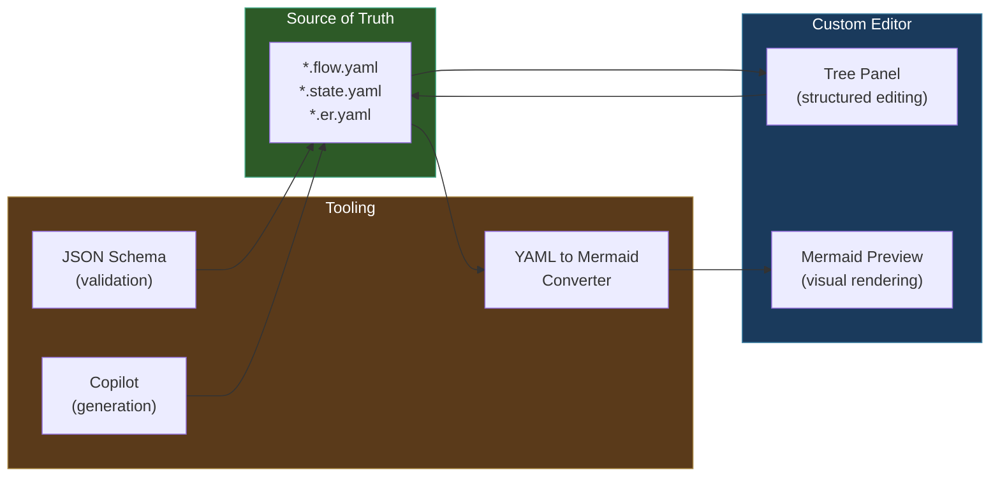

---

## 2. Architecture

### Component Diagram

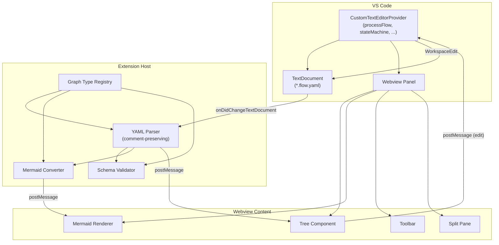

### Data Flow

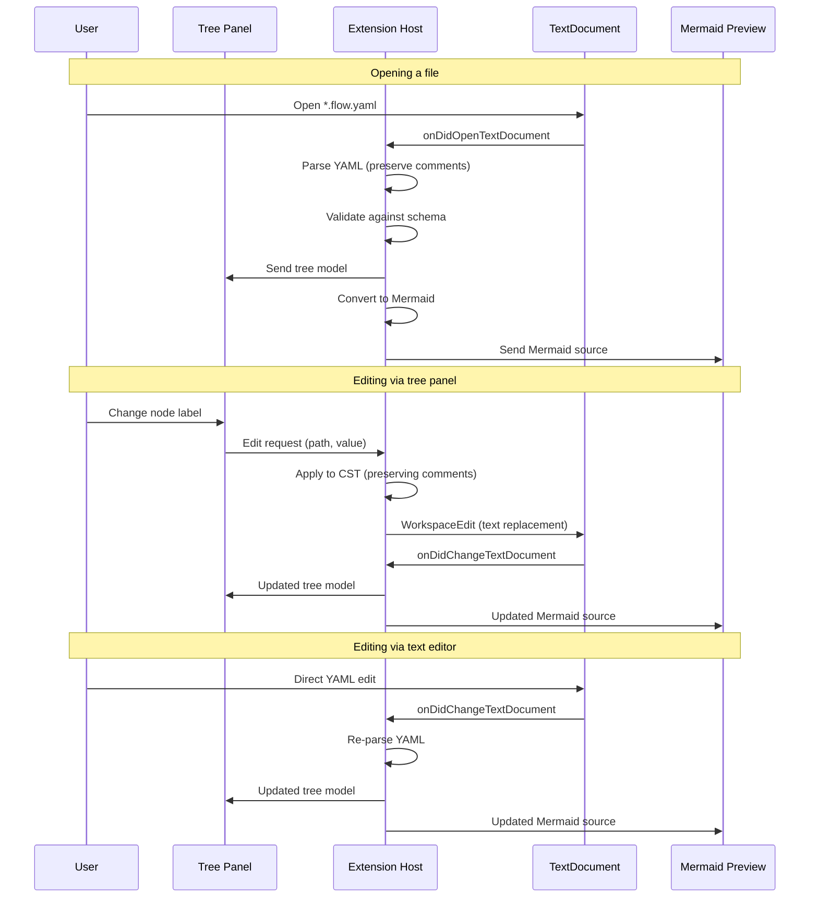

---

## 3. UI Layout

### Main Editor Layout

```
┌─────────────────────────────────────────────────────────┐
│ [+ Node] [+ Edge] [Delete] [Validate] [⟷ Text] │ ↕ ↔ │
├────────────────────────┬────────────────────────────────┤
│  Tree Panel            │  Mermaid Preview               │
│                        │                                │
│  ▼ meta                │   ┌─────────┐                  │
│    id: user-reg        │   │  Start  │                  │
│    title: User Reg...  │   └────┬────┘                  │
│    direction: TD       │        │                       │
│                        │   ┌────▼────┐                  │
│  ▼ nodes               │   │Validate │                  │
│    ⏺ start             │   └────┬────┘                  │
│    ■ validate          │        │                       │
│    ◆ check-email  ←    │   ┌────▼────┐                  │
│    ■ create-account    │   ◇ Email   ◇                  │
│    ■ send-verif        │   │exists?  │                  │
│    ⏹ done              │   └──┬───┬──┘                  │
│                        │    Y │   │ N                   │
│  ▼ edges               │      ▼   ▼                    │
│    start → validate    │   ...       ...               │
│    validate → check..  │                                │
│    check.. →|Yes| s..  │  (selected node highlighted)   │
│    check.. →|No| cr..  │                                │
│    create.. → send..   │                                │
│    send.. → done       │                                │
│                        │                                │
├────────────────────────┴────────────────────────────────┤
│ ⚠ 1 validation issue: edge 'x→y' references unknown... │
└─────────────────────────────────────────────────────────┘
```

### Tree Node Icons by Type

| Icon | Node Type | Mermaid Shape |
|------|-----------|--------------|
| ⏺ | start | `([label])` stadium |
| ⏹ | end | `([label])` stadium |
| ■ | process | `[label]` rectangle |
| ◆ | decision | `{label}` rhombus |
| ▣ | subprocess | `[[label]]` double rectangle |
| ║ | parallel | Parallel gateway |

### Toolbar Actions


- **+ Node** — Add node dialog (pick type, enter id + label)
- **+ Edge** — Add edge (pick from/to from existing nodes)
- **Delete** — Remove selected node or edge (with confirmation if edges reference it)
- **Validate** — Run schema validation, show issues in status bar
- **⟷ Text** — Toggle to standard text editor (Reopen With...)
- **Export SVG** — Save Mermaid rendering as SVG file
- **Layout ↕↔** — Toggle Mermaid direction (TD/LR/BT/RL)

---

## 4. Comment-Preserving YAML Editing

### The Challenge

When the tree panel modifies the YAML, comments must survive. Standard
YAML parse → modify → serialize destroys comments. This is a well-known
problem (similar to Java properties files, XML with comments, etc.).

### Solution: Use the `yaml` npm Package CST Layer

The [`yaml`](https://eemeli.org/yaml/) npm package (already widely used in
VS Code extensions) provides three parsing layers:

| Layer | What it gives you | Comments? |
|-------|-------------------|-----------|
| `YAML.parse()` | Plain JS objects | Lost |
| `YAML.parseDocument()` | AST (Document/Node tree) | **Preserved** |
| `YAML.parseCST()` | Concrete Syntax Tree (tokens) | **Preserved exactly** |

**The `parseDocument()` approach is ideal.** It gives you a mutable AST where:

- Comments are attached to their adjacent nodes
- You can modify values, add/remove keys, and `toString()` preserves comments
- Whitespace and formatting are maintained

### How It Works

```typescript
import { parseDocument } from 'yaml';

// Parse with full AST (comments preserved)
const doc = parseDocument(yamlText);

// Modify a value — comments on surrounding lines are preserved
doc.setIn(['nodes', 'validate', 'label'], 'Validate user input');

// Add a new node — inserted with correct indentation
doc.setIn(['nodes', 'new-step'], doc.createNode({
    type: 'process',
    label: 'New step',
    status: 'planned',
}));

// Delete a node
doc.deleteIn(['nodes', 'old-step']);

// Serialize back — comments, blank lines, formatting preserved
const newYaml = doc.toString();
```

### What Gets Preserved

```yaml
# This is the main process flow
# Author: Alex, 2026-02
meta:
  id: user-registration  # unique process ID
  title: User Registration Flow
  version: 1

nodes:
  start:
    type: start
    label: User clicks Register  # entry point

  # --- Validation phase ---
  validate:
    type: process
    label: Validate input  # ← tree panel changes this
    owner: auth-service    # comments on other lines survive
```

After changing "Validate input" to "Validate user input" via the tree panel,
the file becomes:

```yaml
# This is the main process flow
# Author: Alex, 2026-02
meta:
  id: user-registration  # unique process ID
  title: User Registration Flow
  version: 1

nodes:
  start:
    type: start
    label: User clicks Register  # entry point

  # --- Validation phase ---
  validate:
    type: process
    label: Validate user input  # ← tree panel changes this
    owner: auth-service    # comments on other lines survive
```

All comments, blank lines, and formatting are preserved.

### Edge Cases

| Scenario | Handling |
|----------|---------|
| Comment on deleted node | Removed with node (expected) |
| Comment between nodes | Attached to next node, survives |
| Trailing comment on modified value | **Preserved** — `yaml` AST attaches it correctly |
| Block comment above a section | Preserved — attached to section key node |
| New node insertion | Uses document's existing indentation style |

---

## 5. Generic Framework Design

### Graph Type Registry

The editor framework is generic. Each graph type registers:

```typescript
interface GraphTypeDefinition {
    /** Unique type id, e.g. 'flowchart', 'stateMachine', 'erDiagram' */
    id: string;

    /** File extension pattern, e.g. '*.flow.yaml', '*.state.yaml' */
    filePattern: string;

    /** Path to JSON schema for validation */
    schemaPath: string;

    /** Node types with display metadata */
    nodeTypes: NodeTypeInfo[];

    /** Convert parsed YAML → Mermaid source string */
    toMermaid(doc: ParsedGraphDocument): string;

    /** Tree panel configuration (which fields are editable, etc.) */
    treeConfig: TreePanelConfig;
}
```

### Registration

```typescript
// In extension activation
const registry = new GraphTypeRegistry();

registry.register(flowchartGraphType);    // *.flow.yaml
registry.register(stateMachineGraphType); // *.state.yaml
registry.register(erDiagramGraphType);    // *.er.yaml

// Single editor provider handles all types
const provider = new YamlGraphEditorProvider(context, registry);

vscode.window.registerCustomEditorProvider(
    'dartscript.yamlGraphEditor',
    provider,
    { webviewOptions: { retainContextWhenHidden: true } }
);
```

### Framework Class Diagram

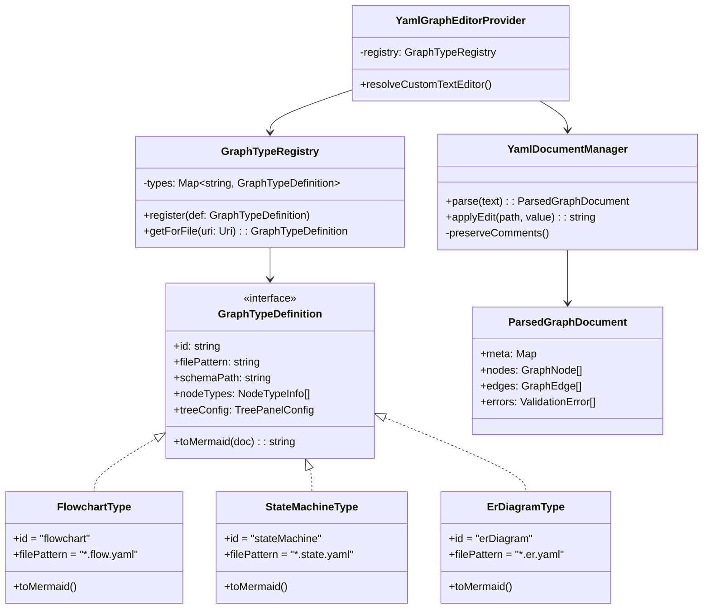

---

## 6. YAML Schema Examples

### Flow Diagram (*.flow.yaml)

```yaml
# yaml-language-server: $schema=../../.tom/json-schema/flow-diagram.schema.json

meta:
  id: user-registration
  title: User Registration Flow
  version: 1
  direction: TD

nodes:
  start:
    type: start
    label: User clicks Register

  validate:
    type: process
    label: Validate input
    owner: auth-service
    status: implemented

  check-email:
    type: decision
    label: Email exists?

  create-account:
    type: process
    label: Create account
    status: implemented

  send-verification:
    type: process
    label: Send verification email
    status: planned
    tags: [email, async]

  show-error:
    type: process
    label: Show duplicate error

  done:
    type: end
    label: Registration complete

edges:
  - from: start
    to: validate

  - from: validate
    to: check-email

  - from: check-email
    to: create-account
    label: "No"

  - from: check-email
    to: show-error
    label: "Yes"

  - from: create-account
    to: send-verification

  - from: send-verification
    to: done
```

**Renders as:**


### State Machine (*.state.yaml)

```yaml
# yaml-language-server: $schema=../../.tom/json-schema/state-machine.schema.json

meta:
  id: order-lifecycle
  title: Order State Machine
  version: 1

states:
  idle:
    type: initial
    label: Idle

  pending:
    type: state
    label: Pending Payment
    entry-action: reserve-inventory

  paid:
    type: state
    label: Paid
    entry-action: notify-warehouse

  shipped:
    type: state
    label: Shipped
    entry-action: send-tracking

  delivered:
    type: final
    label: Delivered

  cancelled:
    type: final
    label: Cancelled

transitions:
  - from: idle
    to: pending
    event: place-order

  - from: pending
    to: paid
    event: payment-received

  - from: pending
    to: cancelled
    event: cancel
    guard: within-cancellation-window

  - from: paid
    to: shipped
    event: warehouse-dispatch

  - from: shipped
    to: delivered
    event: delivery-confirmed
```

**Renders as:**

```mermaid
stateDiagram-v2
    [*] --> Idle
    Idle --> Pending_Payment : place order
    Pending_Payment --> Paid : payment received
    Pending_Payment --> Cancelled : cancel
    Paid --> Shipped : warehouse dispatch
    Shipped --> Delivered : delivery confirmed
    Delivered --> [*]
    Cancelled --> [*]

    Pending_Payment : entry / reserve inventory
    Paid : entry / notify warehouse
    Shipped : entry / send tracking

    note right of Cancelled : Guard: within cancellation window
```

### ER Diagram (*.er.yaml)

```yaml
# yaml-language-server: $schema=../../.tom/json-schema/er-diagram.schema.json

meta:
  id: user-schema
  title: User Management ER

entities:
  User:
    attributes:
      - name: id
        type: int
        key: PK
      - name: email
        type: string
        key: UK
      - name: name
        type: string
      - name: role_id
        type: int
        key: FK

  Role:
    attributes:
      - name: id
        type: int
        key: PK
      - name: name
        type: string

  Session:
    attributes:
      - name: id
        type: int
        key: PK
      - name: user_id
        type: int
        key: FK
      - name: token
        type: string
      - name: expires_at
        type: datetime

relationships:
  - from: User
    to: Role
    type: many-to-one
    label: has

  - from: User
    to: Session
    type: one-to-many
    label: owns
```

**Renders as:**

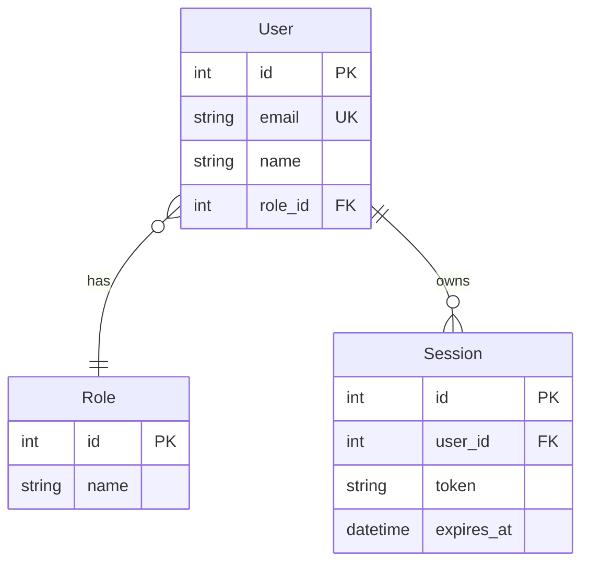

---

## 7. YAML → Mermaid Conversion

Each graph type provides a converter. Examples:

### Flowchart Converter Logic

```
For each node:
  switch (node.type):
    start/end  → id(["label"])
    process    → id["label"]
    decision   → id{"label"}
    subprocess → id[["label"]]

For each edge:
  if edge.label:
    → from -->|"label"| to
  else:
    → from --> to

For status-based styling:
  implemented → green fill
  planned     → yellow fill
  deprecated  → grey fill
```

### State Machine Converter Logic

```
For initial states:
  → [*] --> StateName

For final states:
  → StateName --> [*]

For transitions:
  if guard:
    → From --> To : event\n[guard]
  else:
    → From --> To : event

For entry/exit actions:
  → state Name { entry: action }
```

### ER Diagram Converter Logic

```
For each entity:
  → EntityName {
       type name key(if any)
     }

For each relationship:
  map type to Mermaid notation:
    one-to-one   → ||--||
    one-to-many  → ||--o{
    many-to-one  → }o--||
    many-to-many → }o--o{
  → From notation To : label
```

---

## 8. Mermaid Capabilities Overview

Mermaid supports a wide range of diagram types. Below is a reference of what
is available, with sample diagrams for each type.

### 8.1 Flowchart

The most common diagram type. Supports directions (TD, LR, BT, RL),
subgraphs, various node shapes, and link styles.

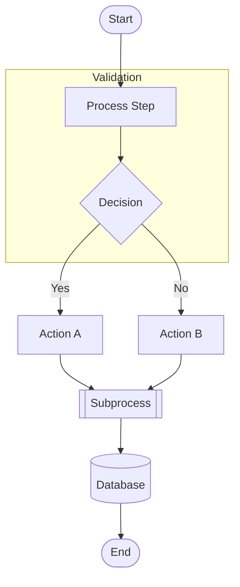

**Node shapes available:**

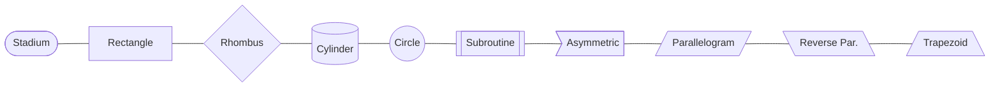

**Link types:**

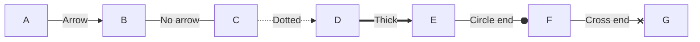

### 8.2 State Diagram

Models state machines with transitions, guards, nested states, forks/joins,
and concurrent regions.

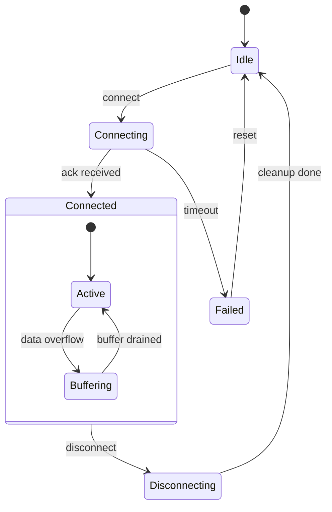

Advanced state features:

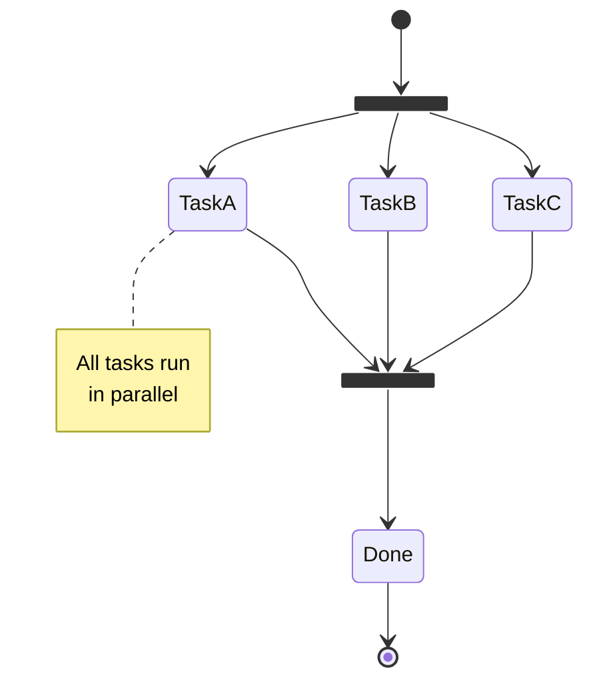

### 8.3 Sequence Diagram

Shows interactions between actors/systems over time. Supports activation,
loops, alternatives, notes, and parallel blocks.

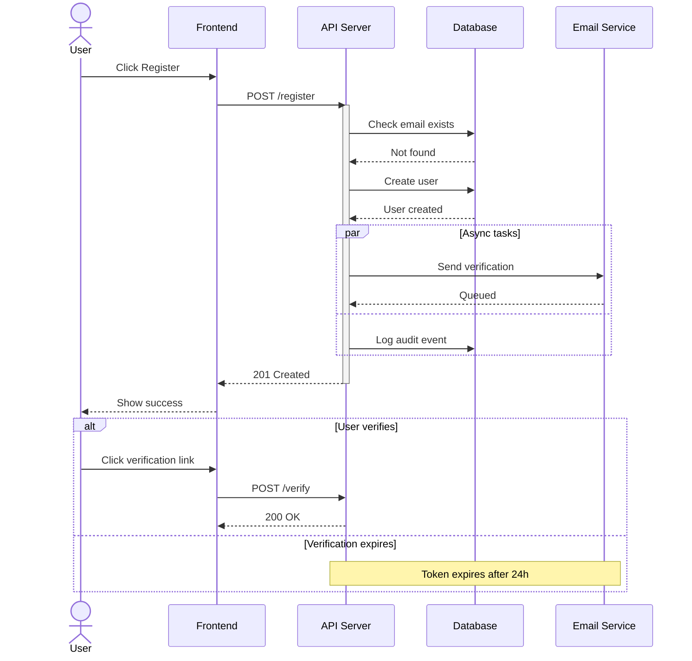

### 8.4 Entity Relationship Diagram

Models database schemas with entities, attributes, and relationships.

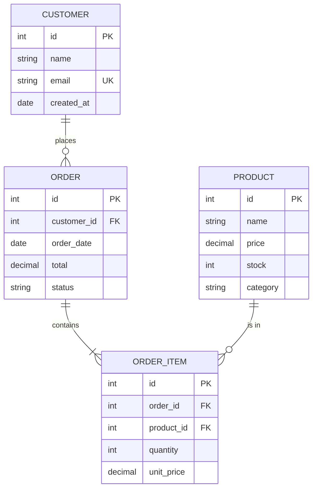

### 8.5 Class Diagram

Models classes, interfaces, relationships, and inheritance.

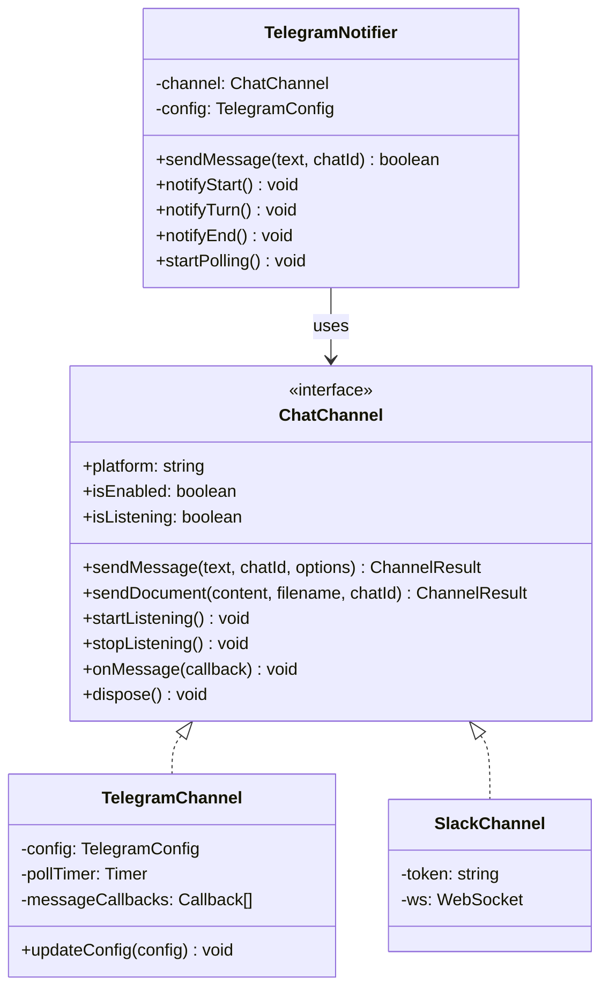

### 8.6 Gantt Chart

Timeline-based project planning.

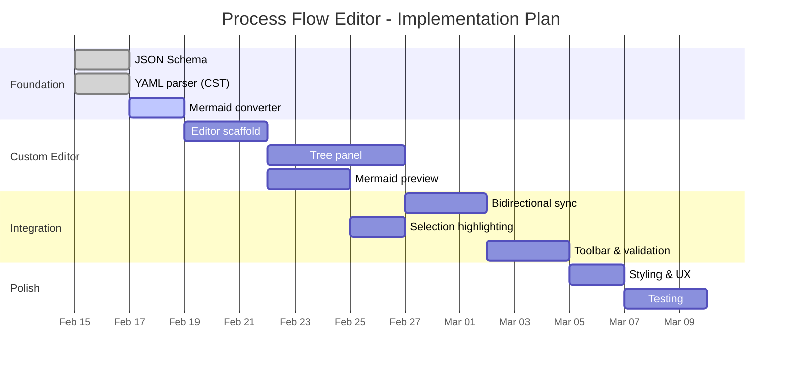

### 8.7 Pie Chart

Simple proportional data display.

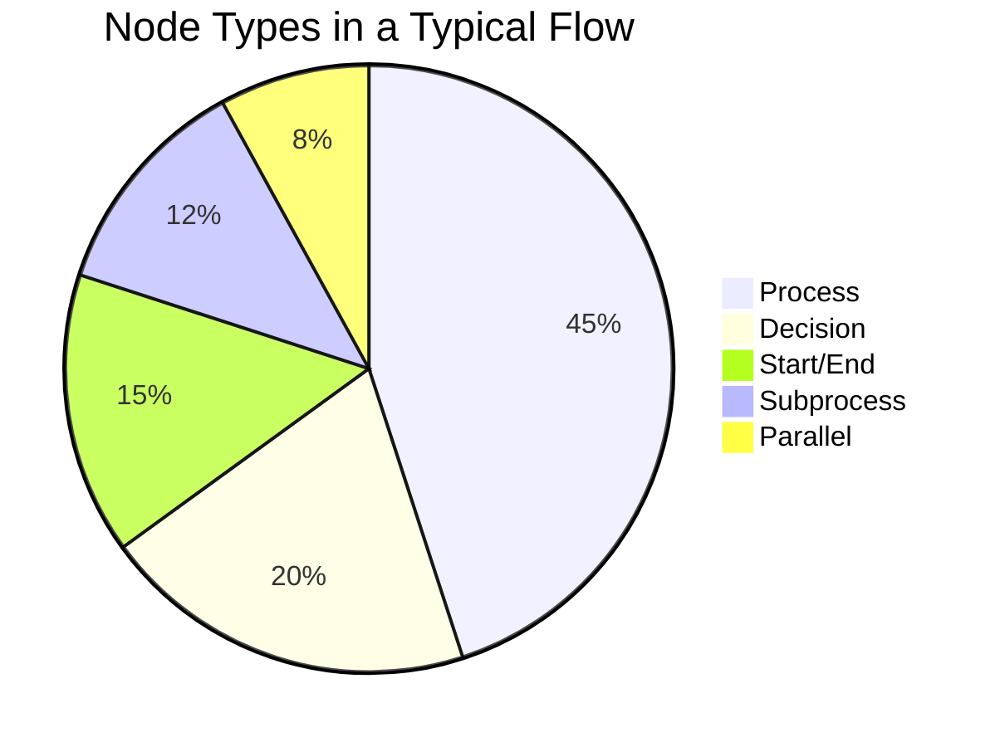

### 8.8 Journey (User Journey)

User experience mapping with satisfaction scores.

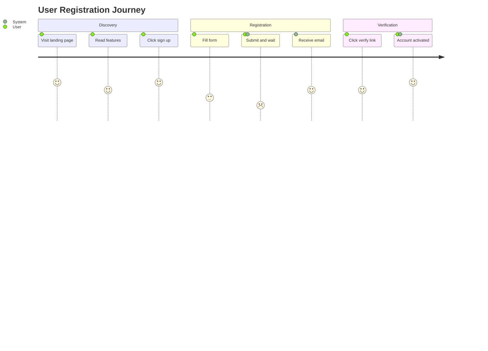

### 8.9 Mindmap

Hierarchical idea organization.

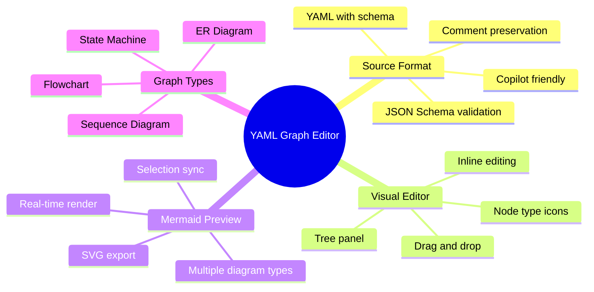

### 8.10 Timeline

Chronological event display.

```mermaid
timeline
    title Tom Extension Evolution
    2025-Q3 : Bridge Scripting
            : Bot Conversations
    2025-Q4 : TOM Panel
            : Issues Panel
            : Telegram Integration
    2026-Q1 : Chat Channel Abstraction
            : YAML Graph Editor
            : Process Flow Modeling
    2026-Q2 : State Machine Editor
            : ER Diagram Editor
```

### 8.11 Quadrant Chart

Two-axis evaluation.

```mermaid
quadrantChart
    title Diagram Tool Evaluation
    x-axis Low AI Compatibility --> High AI Compatibility
    y-axis Low Editability --> High Editability
    Draw.io: [0.2, 0.8]
    Excalidraw: [0.15, 0.7]
    Raw Mermaid: [0.85, 0.5]
    YAML and Schema: [0.9, 0.85]
    D2: [0.6, 0.5]
    bigUML GLSP: [0.1, 0.6]
```

### 8.12 Gitgraph

Git branching visualization.

```mermaid
gitGraph
    commit id: "init"
    commit id: "schema"
    branch feature/tree-panel
    commit id: "tree scaffold"
    commit id: "tree editing"
    checkout main
    branch feature/mermaid-preview
    commit id: "mermaid render"
    commit id: "selection sync"
    checkout main
    merge feature/tree-panel
    merge feature/mermaid-preview
    commit id: "integration"
    commit id: "release v1"
```

### 8.13 Block Diagram (beta)

Block-based system architecture.

```mermaid
flowchart TD
    Frontend["Frontend"]
    Gateway["API Gateway"]
    Auth["Auth Service"]
    Orders["Order Service"]
    Email["Email Service"]
    DB[("Database")]

    Frontend --> Gateway
    Gateway --> Auth
    Gateway --> Orders
    Gateway --> Email
    Auth --> DB
    Orders --> DB
```

### 8.14 Sankey Diagram

Flow/quantity visualization.

```mermaid
sankey-beta

User Request,API Gateway,100
API Gateway,Auth Service,100
Auth Service,Authorized,85
Auth Service,Rejected,15
Authorized,Order Service,50
Authorized,User Service,35
Order Service,Database,50
User Service,Database,35
```

### Mermaid Capability Summary

| Type | Best For | Complexity | YAML Schema Fit |
|------|----------|-----------|----------------|
| **Flowchart** | Process flows, workflows | Low | Excellent |
| **State Diagram** | State machines, lifecycles | Medium | Excellent |
| **Sequence Diagram** | API interactions, protocols | Medium | Good |
| **ER Diagram** | Database schemas | Low | Excellent |
| **Class Diagram** | OOP design, interfaces | Medium | Good |
| **Gantt** | Project timelines | Low | Moderate |
| **Pie Chart** | Proportions | Very low | Low value |
| **Journey** | UX mapping | Low | Moderate |
| **Mindmap** | Brainstorming, hierarchies | Low | Good |
| **Timeline** | Chronological events | Low | Moderate |
| **Quadrant** | Comparative evaluation | Low | Low value |
| **Gitgraph** | Branch strategies | Low | Moderate |
| **Block** | System architecture | Medium | Good |
| **Sankey** | Flow quantities | Medium | Good |

**Best candidates for YAML graph editor** (structured, schema-validatable):
Flowchart, State Diagram, ER Diagram, Class Diagram, Mindmap.

---

## 9. Implementation Plan

### Phase 1 — Foundation (Schema + Converter)

- Define JSON schemas for flowchart and state machine
- Build YAML → Mermaid converters (one per graph type)
- Comment-preserving YAML parser wrapper using `yaml` npm CST
- Can be used standalone (CLI or Copilot-driven) before the editor exists

### Phase 2 — Custom Editor Scaffold

- `CustomTextEditorProvider` with split webview
- Basic tree rendering from parsed YAML
- Basic Mermaid preview using bundled mermaid.js
- File association: `*.flow.yaml`, `*.state.yaml`

### Phase 3 — Tree Editing

- Inline editing of labels, types, status fields
- Add/delete nodes and edges via toolbar
- Comment-preserving writes back to TextDocument
- Schema validation with inline error display

### Phase 4 — Integration

- Selection sync: tree click highlights Mermaid node
- Mermaid click selects tree node
- Status-based styling (implemented=green, planned=yellow)
- Export SVG

### Phase 5 — Additional Graph Types

- ER diagram support
- Class diagram support
- Mindmap support (tree structure is a natural fit)

### Phase 6 — Advanced Features

- Drag-and-drop reordering in tree
- Copilot integration (generate/modify YAML via chat)
- Undo/redo breadcrumbs in toolbar
- Dark/light theme support for Mermaid rendering
