# YAML Graph Editor — Design Proposal

A generic custom editor framework for VS Code that provides structured visual
editing of YAML graph files (flow diagrams, state machines, ER diagrams, etc.)
with a live Mermaid preview.

**Status:** Proposal  
**Date:** 2026-02-14

---

## Table of Contents

- [1. Overview](#1-overview)
- [2. Architecture](#2-architecture)
- [3. UI Layout](#3-ui-layout)
- [4. Comment-Preserving YAML Editing](#4-comment-preserving-yaml-editing)
- [5. Generic Framework Design](#5-generic-framework-design)
- [6. YAML Schema Examples](#6-yaml-schema-examples)
- [7. YAML → Mermaid Conversion](#7-yaml--mermaid-conversion)
- [8. YAML Direct-Edit Flow](#8-yaml-direct-edit-flow)
- [9. Interactive Diagrams](#9-interactive-diagrams)
- [10. Mermaid Capabilities Overview](#10-mermaid-capabilities-overview)
- [11. Implementation Plan](#11-implementation-plan)

---

## 1. Overview

### Problem

Graphical process flows, state machines, and similar diagrams are valuable for
documenting software architecture. But existing tools have fundamental
tradeoffs:

| Tool Type | Editable? | AI-generatable? | Diffable? | Validatable? |
|-----------|----------|-----------------|----------|-------------|
| Draw.io / Excalidraw | Yes (visual) | No (coordinates) | No (XML/JSON) | No |
| Raw Mermaid text | Manual only | Yes (Copilot) | Yes | No (syntax only) |
| **YAML + schema** | **Yes (both)** | **Yes (Copilot)** | **Yes** | **Yes (JSON Schema)** |

### Proposed Solution

YAML files following a strict JSON schema serve as the canonical source.
A custom VS Code editor provides:

1. **Tree panel** — structured editing of nodes, edges, metadata
2. **Mermaid preview** — real-time visual rendering
3. **Comment preservation** — YAML comments survive edits from the tree panel
4. **Schema validation** — inline errors, autocompletion
5. **Generic framework** — same editor works for flow diagrams, state machines,
   ER diagrams by swapping schema + converter

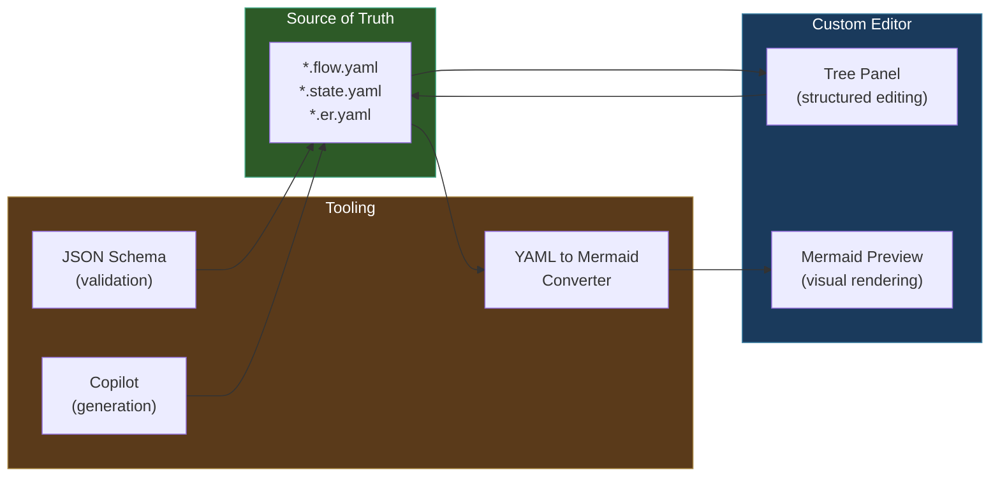
```mermaid
flowchart LR
    subgraph Source["Source of Truth"]
        YAML["*.flow.yaml<br/>*.state.yaml<br/>*.er.yaml"]
    end

    subgraph Editor["Custom Editor"]
        TP["Tree Panel<br/>(structured editing)"]
        MP["Mermaid Preview<br/>(visual rendering)"]
    end

    subgraph Tooling
        SC["JSON Schema<br/>(validation)"]
        CV["YAML to Mermaid<br/>Converter"]
        AI["Copilot<br/>(generation)"]
    end

    YAML --> TP
    TP --> YAML
    YAML --> CV --> MP
    SC --> YAML
    AI --> YAML

    style Source fill:#2d5a27,stroke:#4a8,color:#fff
    style Editor fill:#1a3a5c,stroke:#48a,color:#fff
    style Tooling fill:#5a3a1a,stroke:#a84,color:#fff
```

---

## 2. Architecture

### Component Diagram

**Legend:** Pale green = exists, needs no modification. Yellow = exists, needs
wrapper/adapter. Blue = needs to be built. Orange = configuration files we author.

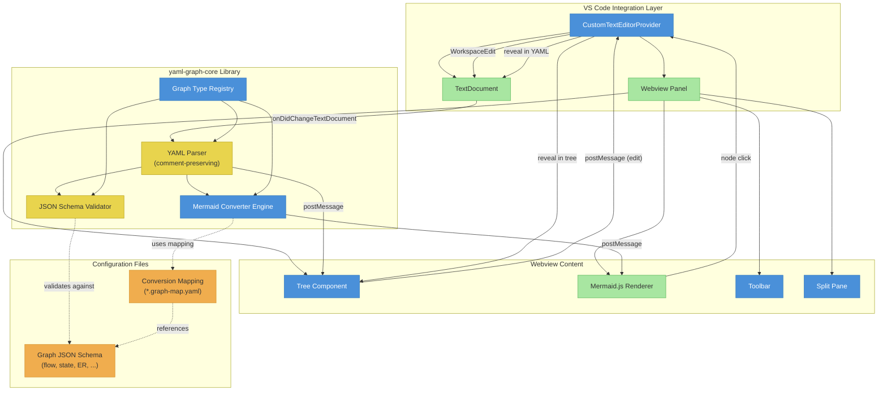
```mermaid
flowchart TD
    subgraph VSCode["VS Code Integration Layer"]
        CE["CustomTextEditorProvider"]
        DOC["TextDocument"]
        WV["Webview Panel"]
    end

    subgraph Webview["Webview Content"]
        TREE["Tree Component"]
        MERMAID["Mermaid.js Renderer"]
        TOOLBAR["Toolbar"]
        SPLIT["Split Pane"]
    end

    subgraph Core["yaml-graph-core Library"]
        PARSER["YAML Parser<br/>(comment-preserving)"]
        SCHEMA["JSON Schema Validator"]
        CONV["Mermaid Converter Engine"]
        REG["Graph Type Registry"]
    end

    subgraph Config["Configuration Files"]
        GSCHEMA["Graph JSON Schema<br/>(flow, state, ER, ...)"]
        MAPPING["Conversion Mapping<br/>(*.graph-map.yaml)"]
    end

    CE --> DOC
    CE --> WV
    WV --> TREE
    WV --> MERMAID
    WV --> TOOLBAR
    WV --> SPLIT

    DOC -- "onDidChangeTextDocument" --> PARSER
    PARSER --> SCHEMA
    SCHEMA -. "validates against" .-> GSCHEMA
    PARSER --> CONV
    CONV -. "uses mapping" .-> MAPPING
    MAPPING -. "references" .-> GSCHEMA
    CONV -- "postMessage" --> MERMAID
    PARSER -- "postMessage" --> TREE

    TREE -- "postMessage (edit)" --> CE
    CE -- "WorkspaceEdit" --> DOC

    MERMAID -- "node click" --> CE
    CE -- "reveal in tree" --> TREE
    CE -- "reveal in YAML" --> DOC

    REG --> PARSER
    REG --> CONV
    REG --> SCHEMA

    style PARSER fill:#e8d44d,stroke:#b8a41d,color:#333
    style SCHEMA fill:#e8d44d,stroke:#b8a41d,color:#333
    style MERMAID fill:#a8e6a1,stroke:#5cb85c,color:#333
    style DOC fill:#a8e6a1,stroke:#5cb85c,color:#333
    style CE fill:#4a90d9,stroke:#357abd,color:#fff
    style WV fill:#a8e6a1,stroke:#5cb85c,color:#333
    style TREE fill:#4a90d9,stroke:#357abd,color:#fff
    style TOOLBAR fill:#4a90d9,stroke:#357abd,color:#fff
    style SPLIT fill:#4a90d9,stroke:#357abd,color:#fff
    style CONV fill:#4a90d9,stroke:#357abd,color:#fff
    style REG fill:#4a90d9,stroke:#357abd,color:#fff
    style GSCHEMA fill:#f0ad4e,stroke:#d49430,color:#333
    style MAPPING fill:#f0ad4e,stroke:#d49430,color:#333
```

### Data Flow

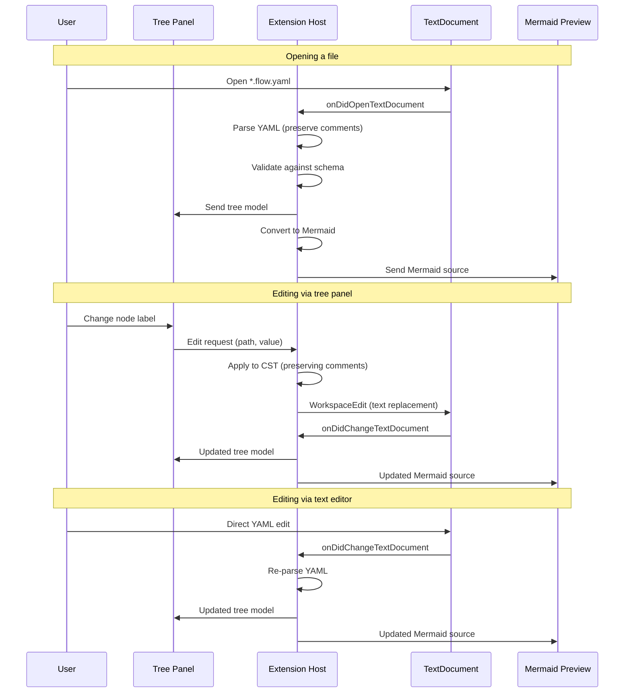
```mermaid
sequenceDiagram
    participant User
    participant Tree as Tree Panel
    participant Ext as Extension Host
    participant Doc as TextDocument
    participant Mermaid as Mermaid Preview

    Note over User,Mermaid: Opening a file
    User->>Doc: Open *.flow.yaml
    Doc->>Ext: onDidOpenTextDocument
    Ext->>Ext: Parse YAML (preserve comments)
    Ext->>Ext: Validate against schema
    Ext->>Tree: Send tree model
    Ext->>Ext: Convert to Mermaid
    Ext->>Mermaid: Send Mermaid source

    Note over User,Mermaid: Editing via tree panel
    User->>Tree: Change node label
    Tree->>Ext: Edit request (path, value)
    Ext->>Ext: Apply to CST (preserving comments)
    Ext->>Doc: WorkspaceEdit (text replacement)
    Doc->>Ext: onDidChangeTextDocument
    Ext->>Tree: Updated tree model
    Ext->>Mermaid: Updated Mermaid source

    Note over User,Mermaid: Editing via text editor
    User->>Doc: Direct YAML edit
    Doc->>Ext: onDidChangeTextDocument
    Ext->>Ext: Re-parse YAML
    Ext->>Tree: Updated tree model
    Ext->>Mermaid: Updated Mermaid source
```

---

## 3. UI Layout

### Main Editor Layout

```
┌─────────────────────────────────────────────────────────┐
│ [+ Node] [+ Edge] [Delete] [Validate] [⟷ Text] │ ↕ ↔ │
├────────────────────────┬────────────────────────────────┤
│  Tree Panel            │  Mermaid Preview               │
│                        │                                │
│  ▼ meta                │   ┌─────────┐                  │
│    id: user-reg        │   │  Start  │                  │
│    title: User Reg...  │   └────┬────┘                  │
│    direction: TD       │        │                       │
│                        │   ┌────▼────┐                  │
│  ▼ nodes               │   │Validate │                  │
│    ⏺ start             │   └────┬────┘                  │
│    ■ validate          │        │                       │
│    ◆ check-email  ←    │   ┌────▼────┐                  │
│    ■ create-account    │   ◇ Email   ◇                  │
│    ■ send-verif        │   │exists?  │                  │
│    ⏹ done              │   └──┬───┬──┘                  │
│                        │    Y │   │ N                   │
│  ▼ edges               │      ▼   ▼                    │
│    start → validate    │   ...       ...               │
│    validate → check..  │                                │
│    check.. →|Yes| s..  │  (selected node highlighted)   │
│    check.. →|No| cr..  │                                │
│    create.. → send..   │                                │
│    send.. → done       │                                │
│                        │                                │
├────────────────────────┴────────────────────────────────┤
│ ⚠ 1 validation issue: edge 'x→y' references unknown... │
└─────────────────────────────────────────────────────────┘
```

### Tree Node Icons by Type

### Editor Layout (Mermaid)

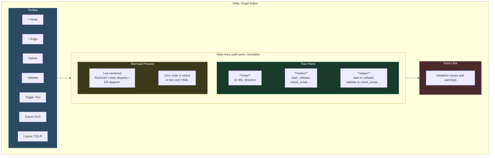
```mermaid
flowchart TD
    subgraph Editor["YAML Graph Editor"]
        subgraph Toolbar["Toolbar"]
            direction LR
            BTN1["+ Node"]
            BTN2["+ Edge"]
            BTN3["Delete"]
            BTN4["Validate"]
            BTN5["Toggle Text"]
            BTN6["Export SVG"]
            BTN7["Layout TD/LR"]
        end

        subgraph MainArea["Main Area (split pane, resizable)"]
            subgraph TreePanel["Tree Panel"]
                META["**meta**<br/>id, title, direction"]
                NODES["**nodes**<br/>start, validate,<br/>check_email, ..."]
                EDGES["**edges**<br/>start to validate,<br/>validate to check_email, ..."]
            end

            subgraph Preview["Mermaid Preview"]
                DIAGRAM["Live rendered<br/>flowchart / state diagram /<br/>ER diagram"]
                CLICK["Click node to select<br/>in tree and YAML"]
            end
        end

        subgraph StatusBar["Status Bar"]
            ISSUES["Validation issues and warnings"]
        end
    end

    Toolbar --> MainArea
    MainArea --> StatusBar
    META --> NODES --> EDGES
    DIAGRAM --- CLICK

    style Toolbar fill:#2d4a63,stroke:#48a,color:#fff
    style TreePanel fill:#1a3a2c,stroke:#4a8,color:#fff
    style Preview fill:#3a3a1a,stroke:#aa4,color:#fff
    style StatusBar fill:#4a2a2a,stroke:#a44,color:#fff
```

### Tree Node Icons by Type

| Icon | Node Type | Mermaid Shape |
|------|-----------|--------------|
| ⏺ | start | `([label])` stadium |
| ⏹ | end | `([label])` stadium |
| ■ | process | `[label]` rectangle |
| ◆ | decision | `{label}` rhombus |
| ▣ | subprocess | `[[label]]` double rectangle |
| ║ | parallel | Parallel gateway |

### Toolbar Actions

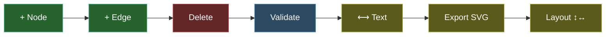
```mermaid
flowchart LR
    A["+ Node"] --> B["+ Edge"]
    B --> C["Delete"]
    C --> D["Validate"]
    D --> E["⟷ Text"]
    E --> F["Export SVG"]
    F --> G["Layout ↕↔"]

    style A fill:#27632d,stroke:#4a8,color:#fff
    style B fill:#27632d,stroke:#4a8,color:#fff
    style C fill:#632727,stroke:#a44,color:#fff
    style D fill:#2d4a63,stroke:#48a,color:#fff
    style E fill:#5a5a1a,stroke:#aa4,color:#fff
    style F fill:#5a5a1a,stroke:#aa4,color:#fff
    style G fill:#5a5a1a,stroke:#aa4,color:#fff
```

- **+ Node** — Add node dialog (pick type, enter id + label)
- **+ Edge** — Add edge (pick from/to from existing nodes)
- **Delete** — Remove selected node or edge (with confirmation if edges reference it)
- **Validate** — Run schema validation, show issues in status bar
- **⟷ Text** — Toggle to standard text editor (Reopen With...)
- **Export SVG** — Save Mermaid rendering as SVG file
- **Layout ↕↔** — Toggle Mermaid direction (TD/LR/BT/RL)

---

## 4. Comment-Preserving YAML Editing

### The Challenge

When the tree panel modifies the YAML, comments must survive. Standard
YAML parse → modify → serialize destroys comments. This is a well-known
problem (similar to Java properties files, XML with comments, etc.).

### Solution: Use the `yaml` npm Package CST Layer

The [`yaml`](https://eemeli.org/yaml/) npm package (already widely used in
VS Code extensions) provides three parsing layers:

| Layer | What it gives you | Comments? |
|-------|-------------------|-----------|
| `YAML.parse()` | Plain JS objects | Lost |
| `YAML.parseDocument()` | AST (Document/Node tree) | **Preserved** |
| `YAML.parseCST()` | Concrete Syntax Tree (tokens) | **Preserved exactly** |

**The `parseDocument()` approach is ideal.** It gives you a mutable AST where:

- Comments are attached to their adjacent nodes
- You can modify values, add/remove keys, and `toString()` preserves comments
- Whitespace and formatting are maintained

### How It Works

```typescript
import { parseDocument } from 'yaml';

// Parse with full AST (comments preserved)
const doc = parseDocument(yamlText);

// Modify a value — comments on surrounding lines are preserved
doc.setIn(['nodes', 'validate', 'label'], 'Validate user input');

// Add a new node — inserted with correct indentation
doc.setIn(['nodes', 'new-step'], doc.createNode({
    type: 'process',
    label: 'New step',
    status: 'planned',
}));

// Delete a node
doc.deleteIn(['nodes', 'old-step']);

// Serialize back — comments, blank lines, formatting preserved
const newYaml = doc.toString();
```

### What Gets Preserved

```yaml
# This is the main process flow
# Author: Alex, 2026-02
meta:
  id: user-registration  # unique process ID
  title: User Registration Flow
  version: 1

nodes:
  start:
    type: start
    label: User clicks Register  # entry point

  # --- Validation phase ---
  validate:
    type: process
    label: Validate input  # ← tree panel changes this
    owner: auth-service    # comments on other lines survive
```

After changing "Validate input" to "Validate user input" via the tree panel,
the file becomes:

```yaml
# This is the main process flow
# Author: Alex, 2026-02
meta:
  id: user-registration  # unique process ID
  title: User Registration Flow
  version: 1

nodes:
  start:
    type: start
    label: User clicks Register  # entry point

  # --- Validation phase ---
  validate:
    type: process
    label: Validate user input  # ← tree panel changes this
    owner: auth-service    # comments on other lines survive
```

All comments, blank lines, and formatting are preserved.

### Edge Cases

| Scenario | Handling |
|----------|---------|
| Comment on deleted node | Removed with node (expected) |
| Comment between nodes | Attached to next node, survives |
| Trailing comment on modified value | **Preserved** — `yaml` AST attaches it correctly |
| Block comment above a section | Preserved — attached to section key node |
| New node insertion | Uses document's existing indentation style |

---

## 5. Generic Framework Design

### Graph Type Registry

The editor framework is generic. Each graph type registers:

```typescript
interface GraphTypeDefinition {
    /** Unique type id, e.g. 'flowchart', 'stateMachine', 'erDiagram' */
    id: string;

    /** File extension pattern, e.g. '*.flow.yaml', '*.state.yaml' */
    filePattern: string;

    /** Path to JSON schema for validation */
    schemaPath: string;

    /** Node types with display metadata */
    nodeTypes: NodeTypeInfo[];

    /** Convert parsed YAML → Mermaid source string */
    toMermaid(doc: ParsedGraphDocument): string;

    /** Tree panel configuration (which fields are editable, etc.) */
    treeConfig: TreePanelConfig;
}
```

### Registration

```typescript
// In extension activation
const registry = new GraphTypeRegistry();

registry.register(flowchartGraphType);    // *.flow.yaml
registry.register(stateMachineGraphType); // *.state.yaml
registry.register(erDiagramGraphType);    // *.er.yaml

// Single editor provider handles all types
const provider = new YamlGraphEditorProvider(context, registry);

vscode.window.registerCustomEditorProvider(
    'dartscript.yamlGraphEditor',
    provider,
    { webviewOptions: { retainContextWhenHidden: true } }
);
```

### Framework Class Diagram

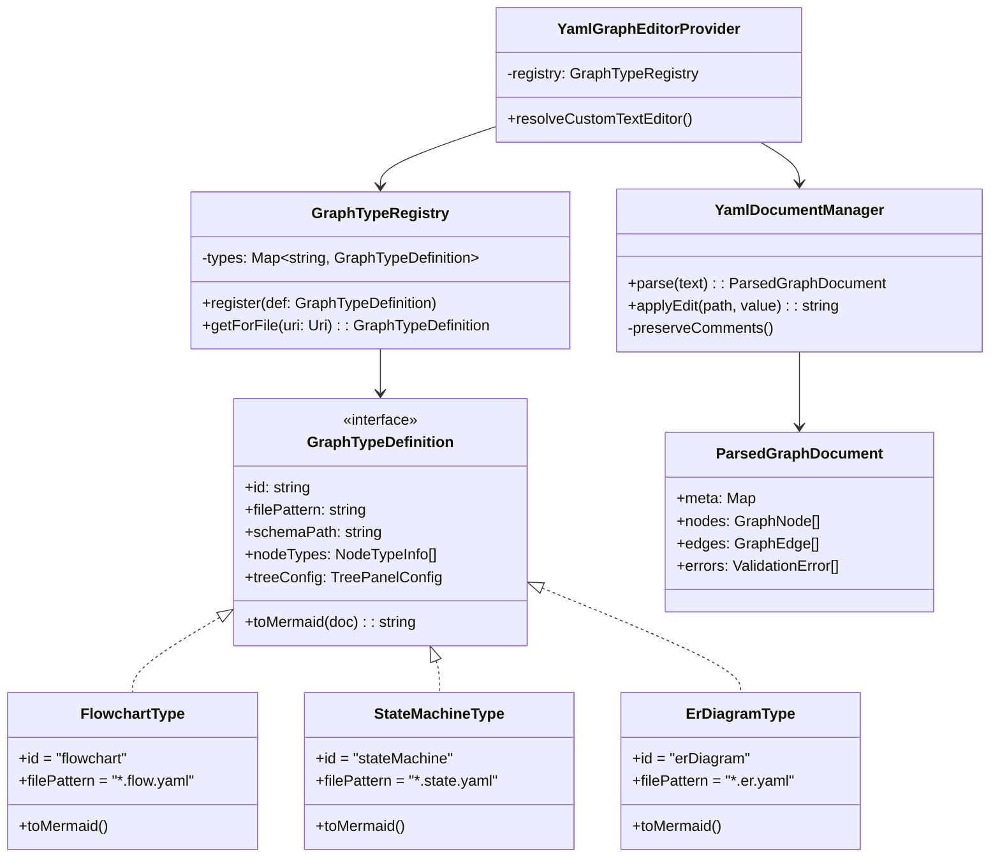
```mermaid
classDiagram
    class YamlGraphEditorProvider {
        +resolveCustomTextEditor()
        -registry: GraphTypeRegistry
    }

    class GraphTypeRegistry {
        +register(def: GraphTypeDefinition)
        +getForFile(uri: Uri): GraphTypeDefinition
        -types: Map~string, GraphTypeDefinition~
    }

    class GraphTypeDefinition {
        <<interface>>
        +id: string
        +filePattern: string
        +schemaPath: string
        +nodeTypes: NodeTypeInfo[]
        +toMermaid(doc): string
        +treeConfig: TreePanelConfig
    }

    class FlowchartType {
        +id = "flowchart"
        +filePattern = "*.flow.yaml"
        +toMermaid()
    }

    class StateMachineType {
        +id = "stateMachine"
        +filePattern = "*.state.yaml"
        +toMermaid()
    }

    class ErDiagramType {
        +id = "erDiagram"
        +filePattern = "*.er.yaml"
        +toMermaid()
    }

    class YamlDocumentManager {
        +parse(text): ParsedGraphDocument
        +applyEdit(path, value): string
        -preserveComments()
    }

    class ParsedGraphDocument {
        +meta: Map
        +nodes: GraphNode[]
        +edges: GraphEdge[]
        +errors: ValidationError[]
    }

    YamlGraphEditorProvider --> GraphTypeRegistry
    GraphTypeRegistry --> GraphTypeDefinition
    GraphTypeDefinition <|.. FlowchartType
    GraphTypeDefinition <|.. StateMachineType
    GraphTypeDefinition <|.. ErDiagramType
    YamlGraphEditorProvider --> YamlDocumentManager
    YamlDocumentManager --> ParsedGraphDocument
```

---

## 6. YAML Schema Examples

### Flow Diagram (*.flow.yaml)

```yaml
# yaml-language-server: $schema=../../.tom/json-schema/flow-diagram.schema.json

meta:
  id: user-registration
  title: User Registration Flow
  version: 1
  direction: TD

nodes:
  start:
    type: start
    label: User clicks Register

  validate:
    type: process
    label: Validate input
    owner: auth-service
    status: implemented

  check-email:
    type: decision
    label: Email exists?

  create-account:
    type: process
    label: Create account
    status: implemented

  send-verification:
    type: process
    label: Send verification email
    status: planned
    tags: [email, async]

  show-error:
    type: process
    label: Show duplicate error

  done:
    type: end
    label: Registration complete

edges:
  - from: start
    to: validate

  - from: validate
    to: check-email

  - from: check-email
    to: create-account
    label: "No"

  - from: check-email
    to: show-error
    label: "Yes"

  - from: create-account
    to: send-verification

  - from: send-verification
    to: done
```

**Renders as:**

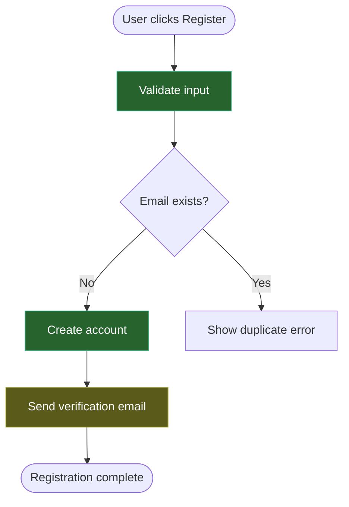
```mermaid
flowchart TD
    start(["User clicks Register"])
    validate["Validate input"]
    check_email{"Email exists?"}
    create_account["Create account"]
    send_verification["Send verification email"]
    show_error["Show duplicate error"]
    done(["Registration complete"])

    start --> validate
    validate --> check_email
    check_email -->|"No"| create_account
    check_email -->|"Yes"| show_error
    create_account --> send_verification
    send_verification --> done

    style validate fill:#27632d,stroke:#4a8,color:#fff
    style create_account fill:#27632d,stroke:#4a8,color:#fff
    style send_verification fill:#5a5a1a,stroke:#aa4,color:#fff
```

### State Machine (*.state.yaml)

```yaml
# yaml-language-server: $schema=../../.tom/json-schema/state-machine.schema.json

meta:
  id: order-lifecycle
  title: Order State Machine
  version: 1

states:
  idle:
    type: initial
    label: Idle

  pending:
    type: state
    label: Pending Payment
    entry-action: reserve-inventory

  paid:
    type: state
    label: Paid
    entry-action: notify-warehouse

  shipped:
    type: state
    label: Shipped
    entry-action: send-tracking

  delivered:
    type: final
    label: Delivered

  cancelled:
    type: final
    label: Cancelled

transitions:
  - from: idle
    to: pending
    event: place-order

  - from: pending
    to: paid
    event: payment-received

  - from: pending
    to: cancelled
    event: cancel
    guard: within-cancellation-window

  - from: paid
    to: shipped
    event: warehouse-dispatch

  - from: shipped
    to: delivered
    event: delivery-confirmed
```

**Renders as:**

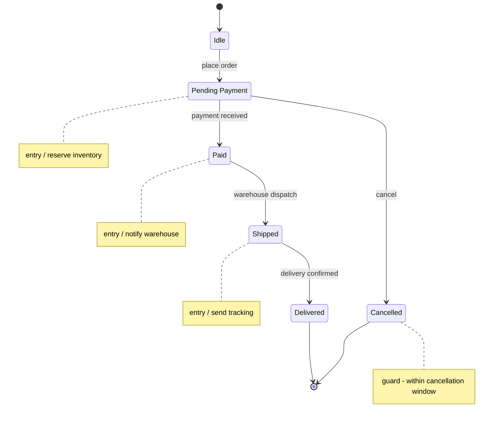
```mermaid
stateDiagram-v2
    [*] --> Idle
    Idle --> PendingPayment : place order
    PendingPayment --> Paid : payment received
    PendingPayment --> Cancelled : cancel
    Paid --> Shipped : warehouse dispatch
    Shipped --> Delivered : delivery confirmed
    Delivered --> [*]
    Cancelled --> [*]

    state "Pending Payment" as PendingPayment

    note right of PendingPayment
        entry / reserve inventory
    end note
    note right of Paid
        entry / notify warehouse
    end note
    note right of Shipped
        entry / send tracking
    end note
    note right of Cancelled
        guard - within cancellation window
    end note
```

### ER Diagram (*.er.yaml)

```yaml
# yaml-language-server: $schema=../../.tom/json-schema/er-diagram.schema.json

meta:
  id: user-schema
  title: User Management ER

entities:
  User:
    attributes:
      - name: id
        type: int
        key: PK
      - name: email
        type: string
        key: UK
      - name: name
        type: string
      - name: role_id
        type: int
        key: FK

  Role:
    attributes:
      - name: id
        type: int
        key: PK
      - name: name
        type: string

  Session:
    attributes:
      - name: id
        type: int
        key: PK
      - name: user_id
        type: int
        key: FK
      - name: token
        type: string
      - name: expires_at
        type: datetime

relationships:
  - from: User
    to: Role
    type: many-to-one
    label: has

  - from: User
    to: Session
    type: one-to-many
    label: owns
```

**Renders as:**

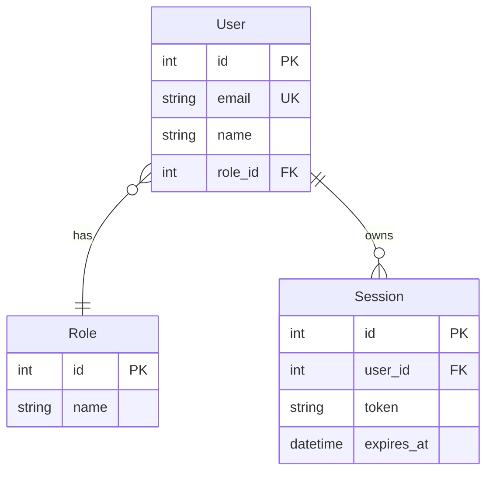
```mermaid
erDiagram
    User {
        int id PK
        string email UK
        string name
        int role_id FK
    }

    Role {
        int id PK
        string name
    }

    Session {
        int id PK
        int user_id FK
        string token
        datetime expires_at
    }

    User }o--|| Role : has
    User ||--o{ Session : owns
```

---

## 7. YAML → Mermaid Conversion

### Approach: Configurable Mapping vs Coded Renderers

Two approaches for converting YAML graph data to Mermaid syntax:

| Approach | Pros | Cons |
|----------|------|------|
| **Coded renderers** (one per diagram type) | Full flexibility, handles complex logic like nesting | More code to maintain, adding a new type requires TypeScript |
| **Mapping configuration** (YAML-driven) | New diagram types without code, easily editable, Copilot-generatable | Complex features (subgraphs, nesting) hard to express declaratively |

**Recommendation: Mapping-driven with escape hatches.** A `*.graph-map.yaml`
file defines the conversion rules for each diagram type. The conversion engine
reads the mapping and generates Mermaid output. Three levels of customization:

1. **Declarative mapping** — covers node shapes, edges, styles, annotations
2. **Inline JS transforms** — small JavaScript fragments embedded in the mapping
   YAML, using an `AstNodeTransformer` signature for local fixes
3. **Custom renderer** — a full TypeScript renderer for diagram types that need
   complete control over Mermaid generation

This means:
- Adding a new simple diagram type = writing a mapping file (no TS code)
- Diagram types with quirks = mapping file + inline JS transforms
- Fully custom diagram types = mapping file + custom renderer plugin
- The mapping file itself can be validated with a JSON Schema

### Conversion Architecture

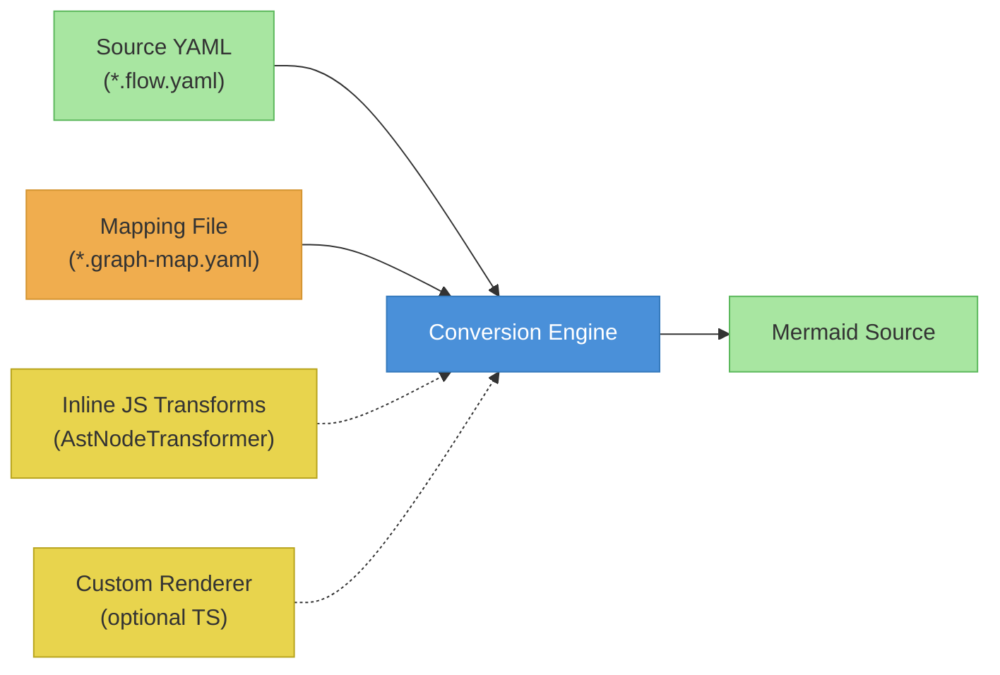
```mermaid
flowchart LR
    YAML["Source YAML<br/>(*.flow.yaml)"] --> ENGINE["Conversion Engine"]
    MAP["Mapping File<br/>(*.graph-map.yaml)"] --> ENGINE
    JS["Inline JS Transforms<br/>(AstNodeTransformer)"] -.-> ENGINE
    PLUGIN["Custom Renderer<br/>(optional TS)"] -.-> ENGINE
    ENGINE --> MERMAID["Mermaid Source"]

    style YAML fill:#a8e6a1,stroke:#5cb85c,color:#333
    style MAP fill:#f0ad4e,stroke:#d49430,color:#333
    style JS fill:#e8d44d,stroke:#b8a41d,color:#333
    style PLUGIN fill:#e8d44d,stroke:#b8a41d,color:#333
    style ENGINE fill:#4a90d9,stroke:#357abd,color:#fff
    style MERMAID fill:#a8e6a1,stroke:#5cb85c,color:#333
```

### Mapping File Format (*.graph-map.yaml)

The mapping file defines how YAML data maps to Mermaid syntax. It uses a
simple, declarative structure:

```yaml
# flowchart.graph-map.yaml
# yaml-language-server: $schema=../../.tom/json-schema/graph-map.schema.json

map:
  id: flowchart
  mermaid-type: flowchart
  direction-field: meta.direction   # YAML path to the direction value
  default-direction: TD

# How to map source YAML nodes to Mermaid node shapes
node-shapes:
  source-path: nodes               # YAML path to the nodes map
  id-field: _key                    # _key = the YAML map key itself
  label-field: label
  type-field: type
  shapes:
    start:    "([{label}])"         # stadium shape
    end:      "([{label}])"
    process:  "[{label}]"           # rectangle
    decision: "{{{label}}}"         # rhombus (escaped braces)
    subprocess: "[[{label}]]"       # double rectangle

# How to map source YAML edges to Mermaid links
edge-links:
  source-path: edges                # YAML path to the edges list
  from-field: from
  to-field: to
  label-field: label                # optional
  link-styles:
    default: "-->"                   # solid arrow
    dotted:  "-.->"
    thick:   "==>"
  label-template: '-->|"{label}"|'   # when label is present

# Style mapping based on field values
style-rules:
  field: status
  rules:
    implemented:
      fill: "#27632d"
      stroke: "#4a8"
      color: "#fff"
    planned:
      fill: "#5a5a1a"
      stroke: "#aa4"
      color: "#fff"
    deprecated:
      fill: "#666"
      stroke: "#999"
      color: "#ccc"

# Inline JS transforms (AstNodeTransformer signature)
# Each transform receives (node, context) and returns modified Mermaid lines.
# Signature: (node: { id, type, fields }, ctx: { allNodes, allEdges }) => string[]
transforms:
  # Example: add tooltip text from tags array
  - match:
      field: tags
      exists: true
    js: |
      return [`click ${node.id} callback "${node.id}"`]

  # Example: wrap nodes with status=subprocess in a subgraph
  - match:
      field: type
      equals: subprocess
    js: |
      return [
        `subgraph ${node.id}_sub["${node.fields.label}"]`,
        `    ${node.id}["${node.fields.label}"]`,
        `end`
      ]

# Optional: full custom renderer (overrides declarative mapping entirely)
# custom-renderer: my-flowchart-renderer
```

### State Machine Mapping Example

```yaml
# state-machine.graph-map.yaml

map:
  id: stateMachine
  mermaid-type: stateDiagram-v2

node-shapes:
  source-path: states
  id-field: _key
  label-field: label
  type-field: type
  shapes:
    initial:  "[*]"                  # Mermaid start marker
    final:    "[*]"                  # Mermaid end marker
    state:    "{id}"                 # plain state name

  # Special: initial states get "[*] --> StateName" prefix
  initial-connector: "[*] --> {id}"
  # Special: final states get "StateName --> [*]" suffix
  final-connector: "{id} --> [*]"

edge-links:
  source-path: transitions
  from-field: from
  to-field: to
  label-field: event
  label-template: '{from} --> {to} : {event}'

# Additional text to append to state descriptions
annotations:
  source-field: entry-action
  template: 'note right of {id}\n    entry / {entry-action}\nend note'

# Inline JS transform for guard conditions on transitions
transforms:
  - scope: edge          # applies to edges, not nodes
    match:
      field: guard
      exists: true
    js: |
      const label = `${edge.fields.event} [${edge.fields.guard}]`
      return [`${edge.from} --> ${edge.to} : ${label}`]
```

### Inline JS Transforms — AstNodeTransformer

The `transforms` array in a mapping file allows embedding small JavaScript
fragments that handle cases too specific for declarative rules. Each transform
follows the `AstNodeTransformer` signature:

```typescript
/**
 * Inline transform signature. The JS fragment in the mapping YAML is
 * wrapped into a function with this signature by the conversion engine.
 */
type AstNodeTransformer = (
    node: {
        id: string;
        type: string;
        fields: Record<string, unknown>;
    },
    context: {
        allNodes: Map<string, NodeData>;
        allEdges: EdgeData[];
        mapping: GraphMapping;
        output: string[];   // lines emitted so far
    }
) => string[];  // Mermaid lines to emit for this node/edge
```

**Execution model:**
- The engine evaluates each transform's `match` condition against the current
  node or edge
- If matched, the `js` fragment executes in a sandboxed `Function()` scope
  with `node`/`edge` and `ctx` provided as arguments
- The returned `string[]` replaces the default Mermaid output for that element
- If no transform matches, the declarative mapping rules apply

**Customization levels:**

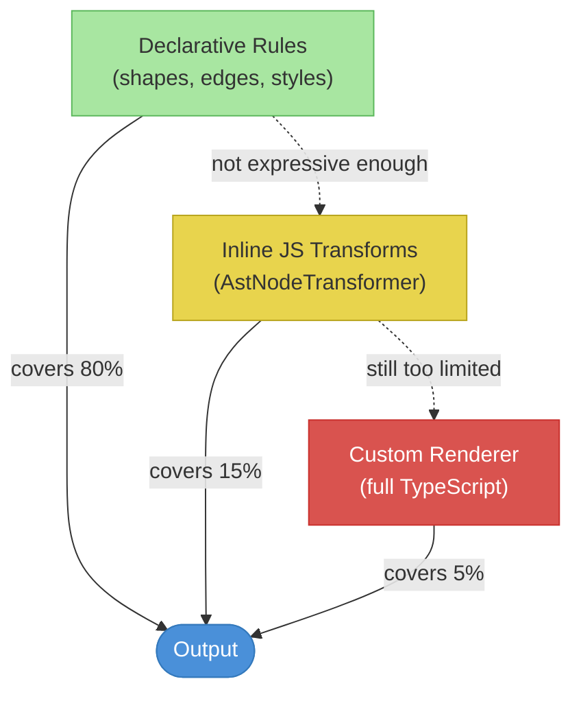
```mermaid
flowchart TD
    D["Declarative Rules<br/>(shapes, edges, styles)"] -->|"covers 80%"| OK(["Output"])
    T["Inline JS Transforms<br/>(AstNodeTransformer)"] -->|"covers 15%"| OK
    R["Custom Renderer<br/>(full TypeScript)"] -->|"covers 5%"| OK

    D -.->|"not expressive enough"| T
    T -.->|"still too limited"| R

    style D fill:#a8e6a1,stroke:#5cb85c,color:#333
    style T fill:#e8d44d,stroke:#b8a41d,color:#333
    style R fill:#d9534f,stroke:#c9302c,color:#fff
    style OK fill:#4a90d9,stroke:#357abd,color:#fff
```

### Conversion Engine Pseudocode

```
function convert(yamlDoc, mapping):
    output = [mapping.mermaid-type + " " + direction]

    // Render nodes
    for each node in yamlDoc[mapping.node-shapes.source-path]:
        id = node[mapping.id-field]
        label = node[mapping.label-field]
        type = node[mapping.type-field]
        shape = mapping.node-shapes.shapes[type]
        output.add( id + shape.replace("{label}", label) )

    // Render edges
    for each edge in yamlDoc[mapping.edge-links.source-path]:
        from = edge[mapping.from-field]
        to = edge[mapping.to-field]
        label = edge[mapping.label-field]
        if label:
            output.add( mapping.label-template with {from, to, label} )
        else:
            output.add( from + " " + mapping.link-styles.default + " " + to )

    // Apply styles
    for each node where style-rules.field matches:
        rule = matching style rule
        output.add( "style " + id + " fill:... " )

    // Apply inline JS transforms (AstNodeTransformer)
    for each node/edge:
        for each transform in mapping.transforms:
            if transform.match matches current element:
                lines = evaluate(transform.js, element, context)
                replace default output for this element with lines
                break  // first matching transform wins

    // Apply custom renderer if registered (overrides everything above)
    if mapping has custom-renderer:
        output = customRenderer.render(yamlDoc, mapping)

    return output.join("\n")
```

### Adding a New Diagram Type

To add support for a new YAML graph type, you create:

1. **A JSON Schema** (e.g., `sequence-diagram.schema.json`) — validates the YAML
2. **A mapping file** (e.g., `sequence.graph-map.yaml`) — defines YAML → Mermaid rules,
   including inline JS transforms for special cases
3. **Optionally a custom renderer** — a full TypeScript renderer for diagram types
   that need complete control over Mermaid generation

No TypeScript code changes required for simple types. Register the new files
in the Graph Type Registry and the editor automatically supports them.

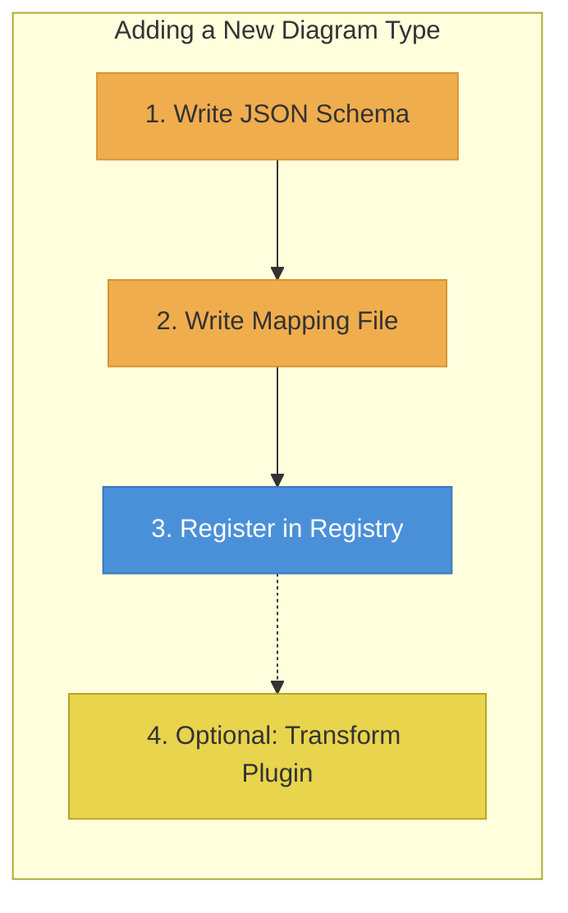
```mermaid
flowchart LR
    subgraph NewType["Adding a New Diagram Type"]
        S1["1. Write JSON Schema"]
        S2["2. Write Mapping File"]
        S3["3. Register in Registry"]
        S4["4. Optional: Transform Plugin"]
    end

    S1 --> S2 --> S3
    S3 -.-> S4

    style S1 fill:#f0ad4e,stroke:#d49430,color:#333
    style S2 fill:#f0ad4e,stroke:#d49430,color:#333
    style S3 fill:#4a90d9,stroke:#357abd,color:#fff
    style S4 fill:#e8d44d,stroke:#b8a41d,color:#333
```

### When to Use Each Customization Level

| Level | Use When | Example |
|-------|----------|--------|
| Declarative only | Straightforward type→shape, field→label | Simple flowcharts, basic ER |
| + Inline JS transforms | One-off adjustments, conditional formatting, edge-case shapes | Guard conditions on state transitions, conditional subgraphs |
| Custom renderer | Radically different output structure, complex nesting, non-standard Mermaid | Sequence diagrams (message ordering), deeply nested state machines |

---

## 8. YAML Direct-Edit Flow

When the user edits the YAML file directly (either in the custom editor's
underlying text document, or by switching to the standard text editor), changes
must propagate to both the tree panel and the Mermaid preview.

### How It Works

VS Code's `CustomTextEditorProvider` is backed by a normal `TextDocument`.
The extension host listens to `onDidChangeTextDocument` events. Any text change
— whether from the tree panel's `WorkspaceEdit` or from the user typing
directly — triggers the same pipeline:

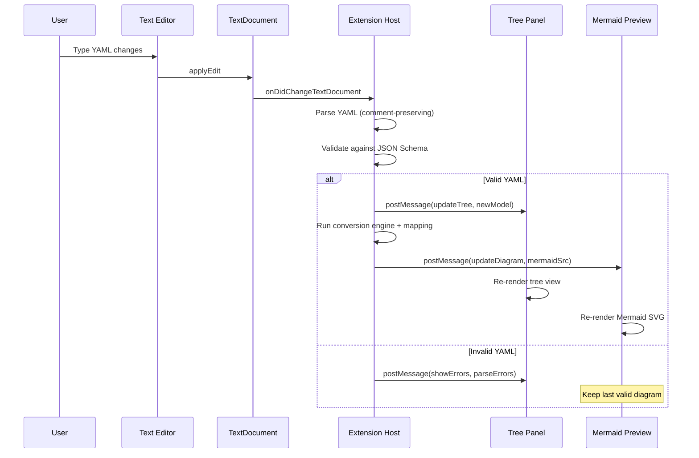
```mermaid
sequenceDiagram
    participant User
    participant TextEditor as Text Editor
    participant Doc as TextDocument
    participant Ext as Extension Host
    participant Tree as Tree Panel
    participant Preview as Mermaid Preview

    User->>TextEditor: Type YAML changes
    TextEditor->>Doc: applyEdit
    Doc->>Ext: onDidChangeTextDocument

    Ext->>Ext: Parse YAML (comment-preserving)
    Ext->>Ext: Validate against JSON Schema

    alt Valid YAML
        Ext->>Tree: postMessage(updateTree, newModel)
        Ext->>Ext: Run conversion engine + mapping
        Ext->>Preview: postMessage(updateDiagram, mermaidSrc)
        Tree->>Tree: Re-render tree view
        Preview->>Preview: Re-render Mermaid SVG
    else Invalid YAML
        Ext->>Tree: postMessage(showErrors, parseErrors)
        Note over Preview: Keep last valid diagram
    end
```

### Key Behaviors

| Scenario | Behavior |
|----------|----------|
| Valid change | Tree and preview update immediately (debounced ~1s) |
| Syntax error mid-typing | Tree shows error indicator, preview keeps last valid state |
| Schema violation | Tree updates but shows validation warning in status bar |
| Adding a new node | Tree expands to show it, preview re-renders with new node |
| Deleting a node with edges | Edges to deleted node highlighted as errors |
| Switching to text editor | Custom editor disposes, standard editor opens same document |
| Switching back to custom editor | Full re-parse and re-render from current document state |

### Debouncing Strategy

Direct typing generates many rapid `onDidChangeTextDocument` events. The
extension debounces these with a ~1 second delay before re-parsing. This avoids
wasted computation during active typing while keeping the preview reasonably
responsive. One second is long enough that most intermediate invalid states
(unclosed brackets, half-typed keys) resolve before the parse triggers, reducing
flickering error indicators.

---

## 9. Interactive Diagrams

### Interaction Model

The Mermaid preview is not a passive image — it supports three primary
interaction types that connect the diagram back to the source data:

1. **Jump to tree** — click a diagram shape to select the corresponding node
   in the tree panel
2. **Jump to YAML line** — click a diagram shape to reveal and highlight the
   corresponding YAML block in the text document
3. **Editor overlay** — click or double-click a shape to open an inline editor
   overlay showing all editable fields (label, type, status, owner, tags, etc.)

### Interaction Flow

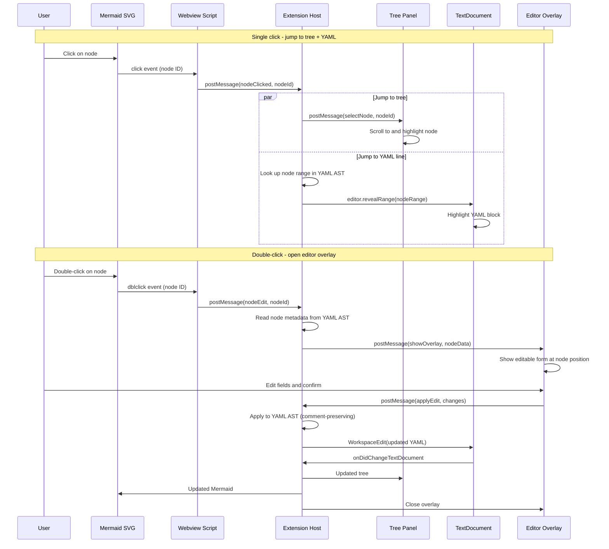
```mermaid
sequenceDiagram
    participant User
    participant SVG as Mermaid SVG
    participant WV as Webview Script
    participant Ext as Extension Host
    participant Tree as Tree Panel
    participant Doc as TextDocument
    participant Overlay as Editor Overlay

    Note over User,Overlay: Single click - jump to tree + YAML
    User->>SVG: Click on node
    SVG->>WV: click event (node ID)
    WV->>Ext: postMessage(nodeClicked, nodeId)

    par Jump to tree
        Ext->>Tree: postMessage(selectNode, nodeId)
        Tree->>Tree: Scroll to and highlight node
    and Jump to YAML line
        Ext->>Ext: Look up node range in YAML AST
        Ext->>Doc: editor.revealRange(nodeRange)
        Doc->>Doc: Highlight YAML block
    end

    Note over User,Overlay: Double-click - open editor overlay
    User->>SVG: Double-click on node
    SVG->>WV: dblclick event (node ID)
    WV->>Ext: postMessage(nodeEdit, nodeId)
    Ext->>Ext: Read node metadata from YAML AST
    Ext->>Overlay: postMessage(showOverlay, nodeData)
    Overlay->>Overlay: Show editable form at node position

    User->>Overlay: Edit fields and confirm
    Overlay->>Ext: postMessage(applyEdit, changes)
    Ext->>Ext: Apply to YAML AST (comment-preserving)
    Ext->>Doc: WorkspaceEdit(updated YAML)
    Doc->>Ext: onDidChangeTextDocument
    Ext->>Tree: Updated tree
    Ext->>SVG: Updated Mermaid
    Ext->>Overlay: Close overlay
```

### 9.1 Jump to Tree

When the user single-clicks a shape in the Mermaid preview, the tree panel
scrolls to and highlights the corresponding node. This uses Mermaid's built-in
`click` callback mechanism.

**Implementation:** The conversion engine adds `click nodeId callback "nodeId"`
to every node in the generated Mermaid source. The webview registers a global
callback:

```javascript
// Webview script
window.mermaidCallback = function(nodeId) {
    vscode.postMessage({ type: 'nodeClicked', nodeId: nodeId });
};
```

**Assessment:** Fully feasible. Mermaid's `click` callback is well-supported.
The only consideration is that callback registration must happen after each
Mermaid re-render (since the SVG is regenerated). This is straightforward —
call `mermaid.run()` and then re-register callbacks, or use event delegation
on the SVG container.

### 9.2 Jump to YAML Line

Single-click also reveals the node's YAML source location. The `yaml` npm
package's `parseDocument()` AST tracks exact source positions for every node:

```typescript
const doc = parseDocument(yamlText);
const node = doc.getIn(['nodes', 'validate'], true); // scalar node
const range = node.range; // [startOffset, valueEndOffset, nodeEndOffset]
```

The extension host converts the byte offset to a `vscode.Position` and calls
`editor.revealRange(range, RevealType.InCenter)` to scroll the text editor.

**Assessment:** Fully feasible. The YAML AST gives precise source positions.
The only subtlety is that when the custom editor is active, the underlying
`TextDocument` may not have a visible text editor — in that case, the
extension would need to open a side-by-side text editor or store the position
for when the user switches to text view.

### 9.3 Editor Overlay

Double-clicking a shape opens an inline editor overlay positioned over the
clicked node in the Mermaid preview. The overlay shows all editable fields
for that node as a small form.

**Overlay content example for a process node:**

```
┌─────────────────────────────┐
│  validate                   │
├─────────────────────────────┤
│  Label:  [Validate input ]  │
│  Type:   [process      ▾]  │
│  Status: [implemented  ▾]  │
│  Owner:  [auth-service   ]  │
│  Tags:   [validation, ...]  │
├─────────────────────────────┤
│  [Cancel]         [Apply]   │
└─────────────────────────────┘
```

**Implementation:** The overlay is a DOM element in the webview, absolutely
positioned over the clicked SVG node's bounding box. It is **not** a separate
VS Code panel — it lives inside the Mermaid preview's webview.

**Positioning:** Query the SVG node element's `getBoundingClientRect()` and
place the overlay div accordingly. Adjust if near viewport edges.

**Editing flow:**
1. User double-clicks a node shape
2. Webview sends `nodeEdit` message with node ID and SVG bounding rect
3. Extension host reads full node data from YAML AST
4. Extension host sends node fields + schema info to webview
5. Webview renders overlay form with current values and field types
6. User edits fields and clicks Apply
7. Webview sends `applyEdit` with changed fields
8. Extension host applies comment-preserving edits to TextDocument
9. Re-render pipeline triggers (tree + preview update)
10. Overlay closes

**Assessment:** Feasible but more complex than the click-to-navigate features.
Key challenges:
- Positioning the overlay correctly relative to the SVG (SVG coordinates vs
  webview viewport coordinates)
- Building a dynamic form from schema metadata (field types, enums, etc.)
- Handling overlay dismissal (Escape key, click outside, Apply/Cancel)
- Ensuring the overlay doesn't interfere with Mermaid pan/zoom if enabled

This should be a Phase 4 feature, after basic tree editing and click-to-navigate
are working.

### Interaction Feasibility Summary

| Interaction | Feasibility | Effort | Phase |
|-------------|-------------|--------|-------|
| **Jump to tree** (single click) | Fully feasible | Low | 3 |
| **Jump to YAML line** (single click) | Fully feasible | Low | 3 |
| **Editor overlay** (double click) | Feasible, complex | Medium-High | 4 |
| Click edge → select in tree | Partial — requires custom SVG event binding | Medium | 5 |
| Hover → tooltip with metadata | Feasible via SVG title or overlay | Low | 3 |

### Selection Synchronization

Selection sync works bidirectionally across all three panes:

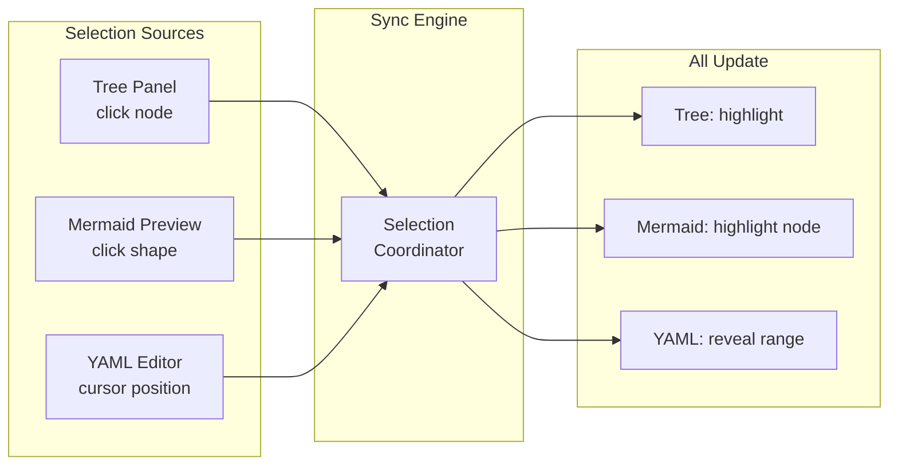
```mermaid
flowchart LR
    subgraph Sources["Selection Sources"]
        T["Tree Panel<br/>click node"]
        M["Mermaid Preview<br/>click shape"]
        Y["YAML Editor<br/>cursor position"]
    end

    subgraph Sync["Sync Engine"]
        SE["Selection<br/>Coordinator"]
    end

    subgraph Targets["All Update"]
        T2["Tree: highlight"]
        M2["Mermaid: highlight node"]
        Y2["YAML: reveal range"]
    end

    T --> SE
    M --> SE
    Y --> SE
    SE --> T2
    SE --> M2
    SE --> Y2
```

---

## 10. Mermaid Capabilities Overview

Mermaid supports a wide range of diagram types. Below is a reference of what
is available, with sample diagrams for each type.

### 10.1 Flowchart

The most common diagram type. Supports directions (TD, LR, BT, RL),
subgraphs, various node shapes, and link styles.


```mermaid
flowchart TD
    A([Start]) --> B[Process Step]
    B --> C{Decision}
    C -->|Yes| D[Action A]
    C -->|No| E[Action B]
    D --> F[[Subprocess]]
    E --> F
    F --> G[(Database)]
    G --> H([End])

    subgraph Validation
        B
        C
    end
```

**Node shapes available:**


```mermaid
flowchart LR
    A([Stadium]) --- B[Rectangle]
    B --- C{Rhombus}
    C --- D[(Cylinder)]
    D --- E((Circle))
    E --- F[[Subroutine]]
    F --- G>Asymmetric]
    G --- H[/Parallelogram/]
    H --- I[\Reverse Par.\]
    I --- J[/Trapezoid\]
```

**Link types:**

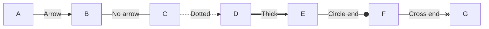
```mermaid
flowchart LR
    A -->|Arrow| B
    B ---|No arrow| C
    C -.->|Dotted| D
    D ==>|Thick| E
    E --o|Circle end| F
    F --x|Cross end| G
```

### 10.2 State Diagram

Models state machines with transitions, guards, nested states, forks/joins,
and concurrent regions.

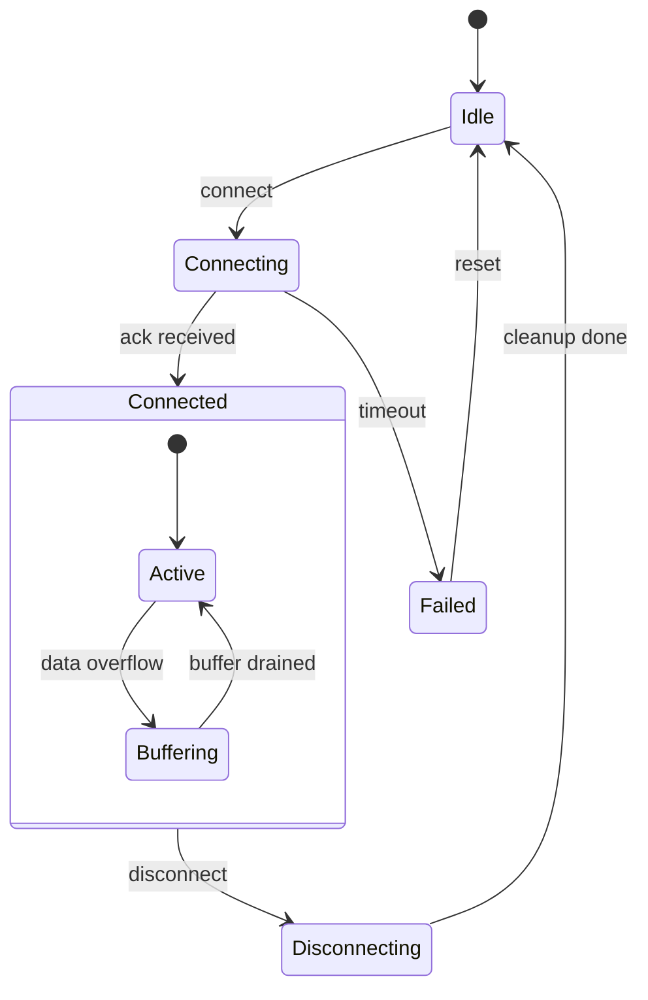
```mermaid
stateDiagram-v2
    [*] --> Idle
    Idle --> Connecting : connect
    Connecting --> Connected : ack received
    Connecting --> Failed : timeout
    Connected --> Disconnecting : disconnect
    Disconnecting --> Idle : cleanup done
    Failed --> Idle : reset

    state Connected {
        [*] --> Active
        Active --> Buffering : data overflow
        Buffering --> Active : buffer drained
    }
```

Advanced state features:

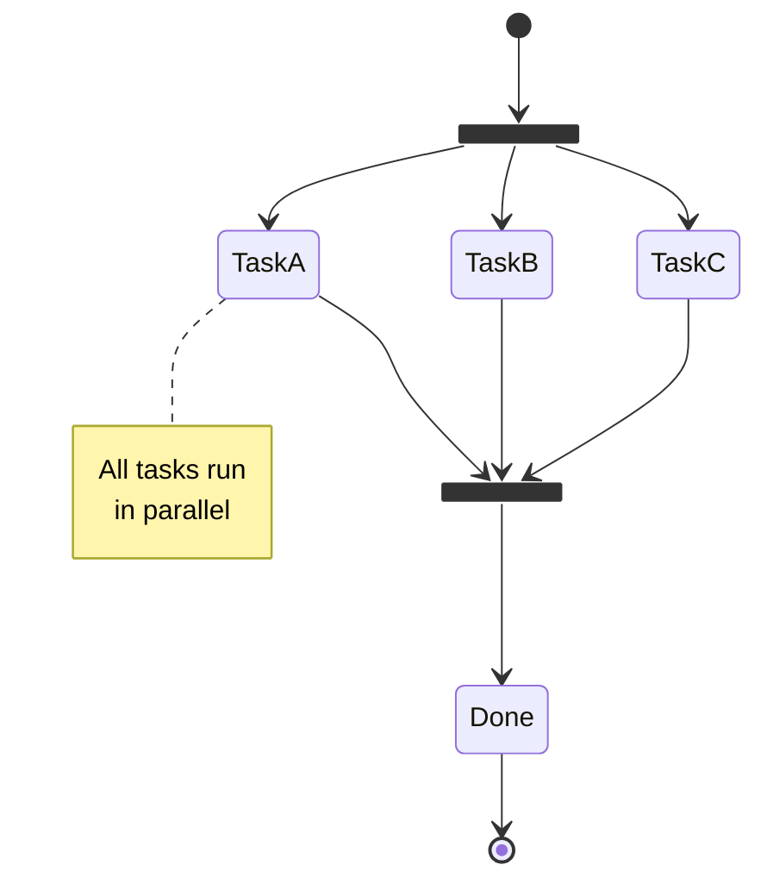
```mermaid
stateDiagram-v2
    state fork_state <<fork>>
    state join_state <<join>>

    [*] --> fork_state
    fork_state --> TaskA
    fork_state --> TaskB
    fork_state --> TaskC

    TaskA --> join_state
    TaskB --> join_state
    TaskC --> join_state

    join_state --> Done
    Done --> [*]

    note right of TaskA
        All tasks run
        in parallel
    end note
```

### 10.3 Sequence Diagram

Shows interactions between actors/systems over time. Supports activation,
loops, alternatives, notes, and parallel blocks.

```mermaid
sequenceDiagram
    actor User
    participant UI as Frontend
    participant API as API Server
    participant DB as Database
    participant Email as Email Service

    User->>UI: Click Register
    UI->>API: POST /register
    activate API

    API->>DB: Check email exists
    DB-->>API: Not found

    API->>DB: Create user
    DB-->>API: User created

    par Async tasks
        API->>Email: Send verification
        Email-->>API: Queued
    and
        API->>DB: Log audit event
    end

    API-->>UI: 201 Created
    deactivate API
    UI-->>User: Show success

    alt User verifies
        User->>UI: Click verification link
        UI->>API: POST /verify
        API-->>UI: 200 OK
    else Verification expires
        Note over API,Email: Token expires after 24h
    end
```

### 10.4 Entity Relationship Diagram

Models database schemas with entities, attributes, and relationships.

```mermaid
erDiagram
    CUSTOMER {
        int id PK
        string name
        string email UK
        date created_at
    }

    ORDER {
        int id PK
        int customer_id FK
        date order_date
        decimal total
        string status
    }

    ORDER_ITEM {
        int id PK
        int order_id FK
        int product_id FK
        int quantity
        decimal unit_price
    }

    PRODUCT {
        int id PK
        string name
        decimal price
        int stock
        string category
    }

    CUSTOMER ||--o{ ORDER : places
    ORDER ||--|{ ORDER_ITEM : contains
    PRODUCT ||--o{ ORDER_ITEM : "is in"
```

### 10.5 Class Diagram

Models classes, interfaces, relationships, and inheritance.

```mermaid
classDiagram
    class ChatChannel {
        <<interface>>
        +platform: string
        +isEnabled: boolean
        +isListening: boolean
        +sendMessage(text, chatId, options) ChannelResult
        +sendDocument(content, filename, chatId) ChannelResult
        +startListening() void
        +stopListening() void
        +onMessage(callback) void
        +dispose() void
    }

    class TelegramChannel {
        -config: TelegramConfig
        -pollTimer: Timer
        -messageCallbacks: Callback[]
        +updateConfig(config) void
    }

    class SlackChannel {
        -token: string
        -ws: WebSocket
    }

    class TelegramNotifier {
        -channel: ChatChannel
        -config: TelegramConfig
        +sendMessage(text, chatId) boolean
        +notifyStart() void
        +notifyTurn() void
        +notifyEnd() void
        +startPolling() void
    }

    ChatChannel <|.. TelegramChannel
    ChatChannel <|.. SlackChannel
    TelegramNotifier --> ChatChannel : uses
```

### 10.6 Gantt Chart

Timeline-based project planning.

```mermaid
gantt
    title Process Flow Editor - Implementation Plan
    dateFormat YYYY-MM-DD
    axisFormat %b %d

    section Foundation
        JSON Schema              :done,    schema,  2026-02-15, 2d
        YAML parser (CST)        :done,    parser,  2026-02-15, 2d
        Mermaid converter        :active,  conv,    2026-02-17, 2d

    section Custom Editor
        Editor scaffold          :         editor,  after conv,  3d
        Tree panel               :         tree,    after editor, 5d
        Mermaid preview          :         preview, after editor, 3d

    section Integration
        Bidirectional sync       :         sync,    after tree,  3d
        Selection highlighting   :         highlight, after preview, 2d
        Toolbar & validation     :         toolbar, after sync,  3d

    section Polish
        Styling & UX             :         style,   after toolbar, 2d
        Testing                  :         test,    after style,  3d
```

### 10.7 Pie Chart

Simple proportional data display.

```mermaid
pie title Node Types in a Typical Flow
    "Process" : 45
    "Decision" : 20
    "Start/End" : 15
    "Subprocess" : 12
    "Parallel" : 8
```

### 10.8 Journey (User Journey)

User experience mapping with satisfaction scores.

```mermaid
journey
    title User Registration Journey
    section Discovery
        Visit landing page : 5 : User
        Read features      : 4 : User
        Click sign up      : 5 : User
    section Registration
        Fill form             : 3 : User
        Submit and wait       : 2 : User, System
        Receive email         : 4 : System
    section Verification
        Click verify link     : 4 : User
        Account activated     : 5 : User, System
```

### 10.9 Mindmap

Hierarchical idea organization.

```mermaid
mindmap
    root((YAML Graph Editor))
        Source Format
            YAML with schema
            Comment preservation
            JSON Schema validation
            Copilot friendly
        Visual Editor
            Tree panel
            Inline editing
            Node type icons
            Drag and drop
        Mermaid Preview
            Real-time render
            Selection sync
            Multiple diagram types
            SVG export
        Graph Types
            Flowchart
            State Machine
            ER Diagram
            Sequence Diagram
```

### 10.10 Timeline

Chronological event display.

```mermaid
timeline
    title Tom Extension Evolution
    2025-Q3 : Bridge Scripting
            : Bot Conversations
    2025-Q4 : TOM Panel
            : Issues Panel
            : Telegram Integration
    2026-Q1 : Chat Channel Abstraction
            : YAML Graph Editor
            : Process Flow Modeling
    2026-Q2 : State Machine Editor
            : ER Diagram Editor
```

### 10.11 Quadrant Chart

Two-axis evaluation.

```mermaid
quadrantChart
    title Diagram Tool Evaluation
    x-axis Low AI Compatibility --> High AI Compatibility
    y-axis Low Editability --> High Editability
    Draw.io: [0.2, 0.8]
    Excalidraw: [0.15, 0.7]
    Raw Mermaid: [0.85, 0.5]
    YAML and Schema: [0.9, 0.85]
    D2: [0.6, 0.5]
    bigUML GLSP: [0.1, 0.6]
```

### 10.12 Gitgraph

Git branching visualization.

```mermaid
gitGraph
    commit id: "init"
    commit id: "schema"
    branch feature/tree-panel
    commit id: "tree scaffold"
    commit id: "tree editing"
    checkout main
    branch feature/mermaid-preview
    commit id: "mermaid render"
    commit id: "selection sync"
    checkout main
    merge feature/tree-panel
    merge feature/mermaid-preview
    commit id: "integration"
    commit id: "release v1"
```

### 10.13 Block Diagram (beta)

Block-based system architecture.

```mermaid
flowchart TD
    Frontend["Frontend"]
    Gateway["API Gateway"]
    Auth["Auth Service"]
    Orders["Order Service"]
    Email["Email Service"]
    DB[("Database")]

    Frontend --> Gateway
    Gateway --> Auth
    Gateway --> Orders
    Gateway --> Email
    Auth --> DB
    Orders --> DB
```

### 10.14 Sankey Diagram

Flow/quantity visualization.

```mermaid
sankey-beta

User Request,API Gateway,100
API Gateway,Auth Service,100
Auth Service,Authorized,85
Auth Service,Rejected,15
Authorized,Order Service,50
Authorized,User Service,35
Order Service,Database,50
User Service,Database,35
```

### Mermaid Capability Summary

| Type | Best For | Complexity | YAML Schema Fit |
|------|----------|-----------|----------------|
| **Flowchart** | Process flows, workflows | Low | Excellent |
| **State Diagram** | State machines, lifecycles | Medium | Excellent |
| **Sequence Diagram** | API interactions, protocols | Medium | Good |
| **ER Diagram** | Database schemas | Low | Excellent |
| **Class Diagram** | OOP design, interfaces | Medium | Good |
| **Gantt** | Project timelines | Low | Moderate |
| **Pie Chart** | Proportions | Very low | Low value |
| **Journey** | UX mapping | Low | Moderate |
| **Mindmap** | Brainstorming, hierarchies | Low | Good |
| **Timeline** | Chronological events | Low | Moderate |
| **Quadrant** | Comparative evaluation | Low | Low value |
| **Gitgraph** | Branch strategies | Low | Moderate |
| **Block** | System architecture | Medium | Good |
| **Sankey** | Flow quantities | Medium | Good |

**Best candidates for YAML graph editor** (structured, schema-validatable):
Flowchart, State Diagram, ER Diagram, Class Diagram, Mindmap.

---

## 11. Implementation Plan

### Phase 1 — Foundation (yaml-graph-core library)

- Create standalone TypeScript/npm package `yaml-graph-core`
- Define JSON schemas for flowchart and state machine
- Define mapping file format and JSON Schema for `*.graph-map.yaml`
- Build mapping-driven conversion engine
- Comment-preserving YAML parser wrapper using `yaml` npm CST
- Write flowchart and state machine mapping files
- Can be used standalone (Node.js, CLI, or any TS project) before the editor exists

### Phase 2 — Custom Editor Scaffold

- `CustomTextEditorProvider` with split webview
- Basic tree rendering from parsed YAML
- Basic Mermaid preview using bundled mermaid.js
- File association: `*.flow.yaml`, `*.state.yaml`

### Phase 3 — Tree Editing

- Inline editing of labels, types, status fields
- Add/delete nodes and edges via toolbar
- Comment-preserving writes back to TextDocument
- Schema validation with inline error display

### Phase 4 — Integration

- Selection sync: tree click highlights Mermaid node
- Mermaid click selects tree node
- Status-based styling (implemented=green, planned=yellow)
- Export SVG

### Phase 5 — Additional Graph Types

- ER diagram support
- Class diagram support
- Mindmap support (tree structure is a natural fit)

### Phase 6 — Advanced Features

- Drag-and-drop reordering in tree
- Copilot integration (generate/modify YAML via chat)
- Undo/redo breadcrumbs in toolbar
- Dark/light theme support for Mermaid rendering
